# Mercetia Calculator - Product Requirements Document

| Field | Value |
|-------|-------|
| **Document** | Mercetia Calculator — Product Requirements Document |
| **Status** | Approved for Phase 1 build |
| **Version** | 2.1 |
| **Owner** | Platform & Payroll Engineering |
| **Last Updated** | 2026-08-12 |
| **Scope** | mercetia-core / -cli / -api / -persistence / -tax-data / -security |

## Table of Contents
{toc}

## Graph Audit Summary

The following table records every anomaly detected by the Graph Engineering audit (orphan nodes, dangling requirements, unresolved edge cases, duplicate nodes, and conflicts) and where each is resolved in this document. AUD-01…AUD-36 were resolved in v2.0; AUD-37…AUD-43 were resolved by the v2.1 enrichment pass (43 defects total).

| # | AUD | Anomaly | Severity | Resolution in this PRD |
|---|-----|---------|----------|------------------------|
| 1 | AUD-01 | Orphan Feature — calculation core referenced by goals with no owning module spec; three requirements dangled | Critical | §1.3 defines `mercetia-core` purity, artifact publication, and ArchUnit/Gradle enforcement (REQ-CORE-PURITY R62, REQ-CORE-ARTIFACT R63, REQ-CORE-RESOURCES R64); OT/hours/calendar rules anchored in §2.1/§2.2 (R13, R11, R12) |
| 2 | AUD-02 | Goals without Persona (5) | Major | §3.3 Personas→Goals mapping: Admin→Compliance; Payroll Specialist→YTD Accuracy; System Integrator→{Low Latency, High Availability, Observability} (REQ-PERSONA-GOALS R48) |
| 3 | AUD-11 | FICA Basis Conflict | Critical | §2.3, §2.3.2, §2.4.1 — YTD-cumulative formulas `ytdSSRemaining`, `ss_subject`, `excess`, `addl` (R4, R5, R24, R25, R33) |
| 4 | AUD-08 | Bracket Version Near-Cycle | Critical | §2.3.3 immutable snapshots per `(year, version_id)` (REQ-BRACKET-SNAPSHOT R39), `If-Match` optimistic lock, READ-ONLY fallback chain (R41) |
| 5 | AUD-09 | YTD Read/Write Ordering | Critical | §2.5 single transaction + pessimistic lock on `employees.version` + `UNIQUE(employee_id, period_start, period_end)` (REQ-YTD-TX R31) |
| 6 | AUD-10 | Deduction Snapshot Ordering | Major | §4.7 snapshot write serialized per employee+period; enforcement decided at snapshot commit (REQ-DEDUCTION-ENFORCEMENT R26) |
| 7 | AUD-20 | Infrastructure SPOF | Critical | §3.6 single-writer primary + standby, read replicas, Hikari pooling, last-known-good bracket cache (REQ-PG-HA R78, REQ-BRACKET-CACHE R79) |
| 8 | AUD-13/14 | Dangling Edge Cases | Major | §5.1–5.6 fully specified: timeouts, circuit breaker, backoff, cache fallback, error format, RTO (R68, R69, R70, R71) |
| 9 | AUD-25 | Conflict: Fallback vs degradedMode | Major | §4.5/§5.4 unified: `degradedMode=true` on any fallback; 503 only when zero bracket data (REQ-DEGRADED-MODE R80) |
| 10 | AUD-26 | Conflict: Batch CSV Contract | Major | §6.2 canonical snake_case CSV + `results.json` identical field names aligned with §4.6 (REQ-BATCH-CONTRACT R35, R61) |
| 11 | AUD-27 | Conflict: Filing-Status Enum | Major | §2.3.2/§4.1 enum = `SINGLE, MFJ, MFS, HOH`; Medicare thresholds $200K/$250K/$125K/$200K (REQ-FILING-STATUS R25) |
| 12 | AUD-29 | Conflict: Semi-Monthly Boundary | Minor | §2.2 P1 = `[1st, 15th)` exclusive end; P2 = `[15th, EOM]` inclusive start; day 15 belongs to P2 (R17) |
| 13 | AUD-34 | Conflict: Bi-Weekly Range | Minor | §2.2 bi-weekly = fixed 14 days (R17) |
| 14 | AUD-31 | Conflict: CLI Naming | Minor | §6 uses `mercetia-calc` everywhere (R60, R61) |
| 15 | AUD-30 | Conflict: Double-Time Activation | Minor | §2.1 double-time ACTIVATED at >80h, mandatory; formula `40r + 40·1.5r + (h−80)·2r` (R13) |
| 16 | AUD-35 | Conflict: Startup Metric | Minor | §3.1 split into two SLAs: API < 3s (REQ-STARTUP-API R74, M11) and CLI < 1s on the Spring-free Picocli fast path (REQ-STARTUP-CLI R96, M12) |
| 17 | AUD-36 | Conflict: 401k Catch-Up | Minor | §3.4 catch-up limit $30,500 (age 50+) added (R29) |
| 18 | AUD-16 | Conflict: Hours Cap vs Double-Time | Minor | §2.1/§2.2 R11 (`0 ≤ h ≤ 168`, 168.5/200 → 422) and R13 (double-time > 80) are consistent, not contradictory |
| 19 | AUD-19 | Deferred Scope Markers | Major | §9.4 + §10 formal `scope=deferred` markers: REQ-OOS-LOCAL-TAX, REQ-OOS-MULTI-STATE, REQ-OOS-MULTI-CURRENCY, REQ-OOS-MULTI-EMPLOYER (R82–R87) |
| 20 | AUD-37 | Phantom module: `mercetia-security` (F18) had no owning requirements | Critical | §1.2/§1.3: F18 re-anchored (NOT folded) — R44–R47 (JWT/RBAC/session fixation) and R49/R50 (PII/secrets) now `BELONGS_TO` F18; co-ownership cross-edges to F9/F10 retained; F18 measured by M3/M4/M5/M6/M16/M17 |
| 21 | AUD-38 | Broken persona chain: Employee (P3) had a goal (self-service data access, G7) with no satisfying feature | Critical | §2.5/§3.3/§4.8: F9 (Auth & RBAC, `view:own`/`update:ownTaxProfile`) and F7 (Calculation History, `view:own`) now SATISFY G7 |
| 22 | AUD-39 | Dangling edge case: API/CLI config divergence (E30) unexposed and unmitigated | Major | §5.7/§7: F14/F15 → EXPOSES → E30; REQ-CFG-PROPS (R65/R66) → MITIGATES → E30 (shared-parent config contract) |
| 23 | AUD-40 | Orphan system dep: Springdoc (D22) had no consuming requirement | Major | §4.3/§9 Phase 3: new REQ-OPENAPI (R91) added under the API feature (F14); R91 → DEPENDS_ON → D22 + D13 (`/v3/api-docs`, `/swagger-ui`) |
| 24 | AUD-41 | Unmeasured features: Deductions & Limits (F4) and Calculation History (F7) had no metrics | Major | §3.7: new M26 (deduction-limit accuracy) → F4 and M27 (audit completeness) → F7 |
| 25 | AUD-42 | Duplicate requirement nodes: R1≡R13, R2≡R11, R3≡R39, R6≡R26, R9≡R12, R10≡R17 | Minor | Merged to canonical single nodes (REQ-* / richer label wins); all BELONGS_TO/DEPENDS_ON/MITIGATES edges re-wired to the canonical node (enriched-graph MAPPING) |
| 26 | AUD-43 | Core-purity self-reference: R62 (REQ-CORE-PURITY) → D4 (the core itself) | Minor | R62→D4 edge removed; enforcement carried by ArchUnit + Gradle module dependency check (D25) per §1.3 |

**Result: 0 orphan nodes, 0 dangling edge cases, 0 unresolved conflicts, 0 broken persona chains; 100% path continuity Persona→Goal→Feature→Requirement→Metric (43 defects resolved).**

---

## System Dependency Graph

```mermaid
flowchart LR
  subgraph Personas
    P1["Admin"]
    P2["Payroll Specialist"]
    P3["Employee"]
    P4["System Integrator"]
  end
  subgraph Goals
    G1["Low Latency"]
    G2["High Availability"]
    G3["Observability"]
    G4["Compliance"]
    G5["YTD Accuracy"]
    G6["Security"]
    G7["Self-service access to own data"]
  end
  subgraph Features
    F1["Gross Pay Calc"]
    F2["Tax Brackets & Calc"]
    F3["FICA YTD Calc"]
    F4["Deductions & Limits"]
    F5["YTD Accumulator"]
    F6["Batch Processing"]
    F7["Calculation History"]
    F8["Tax Bracket Mgmt"]
    F9["Auth & RBAC"]
    F10["Secrets & PII Protection"]
    F11["Health & Metrics"]
    F12["CLI Tool"]
    F14["mercetia-api module"]
    F15["mercetia-cli module"]
    F18["mercetia-security module"]
  end
  subgraph Requirements
    R4["FICA SS YTD wage base"]
    R5["Medicare 0.9% YTD threshold"]
    R7["YTD serialized + idempotent"]
    R8["Canonical batch CSV"]
    R11["Hours cap 0-168"]
    R12["java.time calendar rules"]
    R13["OT formula 40/1.5/2.0"]
    R17["Pay frequencies 7-35"]
    R26["Deduction enforcement STOP/WARN/EXCEED"]
    R39["Bracket snapshot immutable"]
    R91["REQ-OPENAPI via Springdoc"]
    R96["CLI Spring-free startup < 1s"]
  end
  subgraph SysDeps
    D1["PostgreSQL primary + standby"]
    D2["Read replicas"]
    D3["In-memory bracket cache"]
    D4["mercetia-core pure Java"]
    D5["OpenTelemetry"]
    D6["Prometheus"]
    D7["Vault / Secrets Manager"]
    D8["Gradle artifact"]
    D14["Picocli"]
    D22["Springdoc OpenAPI"]
  end
  subgraph EdgeCases
    E1["DB outage"]
    E2["Network failure"]
    E3["Fallback to earlier-year brackets"]
    E4["Over 80h double time"]
    E5["OT across period boundary"]
    E6["Leap year / Feb 29"]
    E7["Month-end semi-monthly"]
    E30["API/CLI config divergence"]
  end
  subgraph Metrics
    M1["p95 < 200ms"]
    M2["10K batch < 30s"]
    M3["Auth uptime >= 99.9%"]
    M4["0 PII in logs"]
    M5["Token validation failure < 0.1%"]
    M6["Secret rotation < 24h"]
    M26["Deduction-limit accuracy"]
    M27["Audit completeness"]
  end
  P4 -->|HAS_GOAL| G1
  P4 -->|HAS_GOAL| G2
  P4 -->|HAS_GOAL| G3
  P1 -->|HAS_GOAL| G4
  P1 -->|HAS_GOAL| G6
  P2 -->|HAS_GOAL| G5
  P3 -->|HAS_GOAL| G7
  F1 -->|SATISFIES| G1
  F6 -->|SATISFIES| G1
  F12 -->|SATISFIES| G1
  F8 -->|SATISFIES| G2
  F14 -->|SATISFIES| G2
  F11 -->|SATISFIES| G3
  F2 -->|SATISFIES| G4
  F3 -->|SATISFIES| G5
  F5 -->|SATISFIES| G5
  F7 -->|SATISFIES| G7
  F9 -->|SATISFIES| G6
  F10 -->|SATISFIES| G6
  F18 -->|SATISFIES| G6
  R13 -->|BELONGS_TO| F1
  R12 -->|BELONGS_TO| F1
  R17 -->|BELONGS_TO| F1
  R11 -->|BELONGS_TO| F1
  R4 -->|BELONGS_TO| F3
  R5 -->|BELONGS_TO| F3
  R7 -->|BELONGS_TO| F5
  R8 -->|BELONGS_TO| F6
  R26 -->|BELONGS_TO| F4
  R39 -->|BELONGS_TO| F8
  R91 -->|BELONGS_TO| F14
  R96 -->|BELONGS_TO| F15
  R11 -->|DEPENDS_ON| D4
  R13 -->|DEPENDS_ON| D4
  R4 -->|DEPENDS_ON| D1
  R5 -->|DEPENDS_ON| D1
  R7 -->|DEPENDS_ON| D1
  R8 -->|DEPENDS_ON| D8
  R39 -->|DEPENDS_ON| D3
  R91 -->|DEPENDS_ON| D22
  R96 -->|DEPENDS_ON| D14
  F1 -->|EXPOSES| E2
  F1 -->|EXPOSES| E4
  F1 -->|EXPOSES| E5
  F1 -->|EXPOSES| E6
  F1 -->|EXPOSES| E7
  F8 -->|EXPOSES| E3
  F5 -->|EXPOSES| E1
  F6 -->|EXPOSES| E1
  F14 -->|EXPOSES| E30
  R7 -->|MITIGATES| E1
  R13 -->|MITIGATES| E4
  R13 -->|MITIGATES| E5
  R12 -->|MITIGATES| E6
  R12 -->|MITIGATES| E7
  R39 -->|MITIGATES| E3
  F1 -->|MEASURED_BY| M1
  F6 -->|MEASURED_BY| M2
  F9 -->|MEASURED_BY| M3
  F9 -->|MEASURED_BY| M5
  F10 -->|MEASURED_BY| M4
  F10 -->|MEASURED_BY| M6
  F4 -->|MEASURED_BY| M26
  F7 -->|MEASURED_BY| M27
```



---

## 1. Project Overview

**Project Name:** Mercetia Calculator  
**Type:** Java/Gradle multi-module project  
**Java Version:** 21 (LTS)  
**Framework:** Spring Boot 3.x  
**Build Tool:** Gradle (Kotlin DSL)

### 1.1 Purpose

Mercetia Calculator is a production-grade Java calculation library and service supporting multiple pay types, US federal/state taxes, various pay frequencies, and full deduction modeling. It deploys in three shapes: a Gradle-published library (`mercetia-core`), a CLI tool (`mercetia-calc`, built with Picocli), and a Spring Boot REST API.

**SLA:** Single calculation < 50ms wall-clock (2.5GHz+, 8GB RAM); Batch 10K calculations < 30s; API p95 response < 200ms; Memory < 500MB heap for typical employee payloads (< 200 compensation elements).

### 1.2 Scope

**In Scope:**
- **Core Library (mercetia-core):** Pure Java calculation engine (no Spring dependencies) — gross pay, tax, and deduction calculations with BigDecimal precision, Banker's rounding (HALF_EVEN) per IRS Publication 15-T
- **CLI Module (mercetia-cli):** Command-line interface for interactive/bulk calculations with Picocli; supports single calculation, batch from CSV (canonical contract, §6.2), and tax bracket management
- **API Module (mercetia-api):** Spring Boot REST service with JSON responses, JWT authentication, and OpenAPI/Swagger documentation
- **Persistence (mercetia-persistence):** PostgreSQL with JPA/Hibernate for employee records, tax brackets, calculation history, and Flyway migrations
- **Tax Data (mercetia-tax-data):** Tax bracket seed data, yearly migrations, and state-specific withholding configurations
- **Security (mercetia-security):** JWT authentication, RBAC authorization, PII masking, and secrets management — the shipped security module (F18) **owns** the security requirements R44–R47 (JWT/RBAC/session fixation) and R49/R50 (PII/secrets) per AUD-37; `mercetia-api` consumes it (§1.3)

**Out of Scope (Phase 1):**
- Full benefits administration/enrollment workflow (deduction modeling only)
- City/county local taxes (NYC, Philadelphia, etc.) — `REQ-OOS-LOCAL-TAX` (R82, scope=deferred, Phase 2+)
- Multi-state employee workflows — `REQ-OOS-MULTI-STATE` (R83, scope=deferred, Phase 2+)
- Full reporting/forms generation (W-2, 941 equivalents) — `REQ-OOS-REPORTING` (R86, scope=deferred, Phase 2+)
- Webhook/payroll provider sync integrations — `REQ-OOS-PROVIDERS` (R87, scope=deferred, Phase 2+)
- Multi-currency support — `REQ-OOS-MULTI-CURRENCY` (R84, scope=deferred, Phase 2+)
- Multi-employer SS wage reconciliation — `REQ-OOS-MULTI-EMPLOYER` (R85, scope=deferred, Phase 2+)
- Real-time payroll processing

**Boundaries:**
- `mercetia-core` remains Spring-free; Spring Boot dependencies confined to `mercetia-api` and `mercetia-cli`
- Deduction modeling covers pre-tax, post-tax, and employer-paid categories as defined in the domain model
- Tax bracket updates via API without code changes, subject to immutable snapshot version gating (§2.3.3)

### 1.3 Module Architecture

`mercetia-core` is the foundational node of the dependency graph. Every module consumes it; it consumes nothing.

**Core purity (REQ-CORE-PURITY / R62):**
- `mercetia-core` is pure Java 21 — **zero Spring imports** at compile time, including `spring-context`, `spring-boot`, and `jakarta.*` annotations.
- Enforcement is automated: a Gradle module dependency check task and an ArchUnit test in CI both fail the build on any Spring (or non-JDK) dependency leaking into `mercetia-core`. Violations are blocking, not warning-level. (Enforcement dependency is D25 ArchUnit + Gradle module check, not the core itself — AUD-43.)
- All monetary math inside the core uses `BigDecimal` with `HALF_EVEN` rounding; floating-point types (`float`/`double`) are forbidden by the same ArchUnit rule.

**Artifact publication (REQ-CORE-ARTIFACT / R63):**
- `mercetia-core` is published as a Gradle artifact (e.g. `com.mercetia:mercetia-core:1.0.0`) and consumed by both `mercetia-cli` and `mercetia-api`. Java 21 + Gradle KTS (ADR-003) are wired through the core build so all downstream modules inherit the same toolchain (AUD-03/04).

**Resource envelope (REQ-CORE-RESOURCES / R64):**
- Heap usage < 500MB for typical employee payloads (< 200 compensation elements); GC pause < 100ms during calculation workloads (measured per §3.1).

**Module dependency rules (R76):**
- `mercetia-core` ← `mercetia-tax-data`, `mercetia-persistence`, `mercetia-cli`, `mercetia-api`, `mercetia-security`
- `mercetia-security` ← `mercetia-api` (auth is API-layer concern)
- `mercetia-tax-data` + `mercetia-persistence` ← `mercetia-api`, `mercetia-cli`
- No module may depend on another module's internals; shared contracts live in `mercetia-core`.

**Security module ownership (F18, AUD-37):** `mercetia-security` is a first-class shipped module that owns R44 (JWT auth), R45 (RBAC), R46 (session fixation), R47 (auth_tokens storage), R49 (PII handling), and R50 (secrets management). Co-ownership cross-edges to F9 (Auth & RBAC) and F10 (Secrets & PII Protection) are retained: the graph model treats those features as the functional faces of the module's contracts.

## 2. Functional Requirements

### 2.1 Pay Types Supported

| Pay Type | Description | Given/When/Then |
|----------|-------------|-----------------|
| **Hourly** | Regular hours, overtime (1.5x after 40hrs/week), double time (2x) | **Given** an hourly employee with rate r and hours h (0 ≤ h ≤ 168 per Mon–Sun week): **Then** gross = `h·r` when `h ≤ 40`; `40r + (h−40)·1.5r` when `40 < h ≤ 80`; `40r + 40·1.5r + (h−80)·2r` when `h > 80`. Double time is ACTIVATED above 80 hours — it is mandatory, not optional. Hours > 168 in a week are rejected with `422 INVALID_HOURS`. Overtime is computed against the 40-hour Mon–Sun threshold regardless of pay-period boundary (AUD-16). Accuracy: within $0.01 of IRS test vectors. |
| **Salaried** | Fixed amount per pay period (annual salary / pay periods) | **Given** a salaried employee with annual salary S and pay frequency F: **When** calculating gross pay per period: **Then** gross = S / periods_per_year(F). Daily-rate proration uses a 366-day denominator on leap years, 365 otherwise. Accuracy: within $0.01 of test vectors. |
| **Commission** | Base salary + commission percentage on sales/revenue | **Given** a commission employee with base salary B, commission rate c, and sales S: **When** calculating gross pay: **Then** gross = B + (S * c). Commission base source (gross vs net) configured per employee. |
| **Hybrid** | Combination of above (e.g., hourly + commission) | **Subsection 2.1.1:** Hybrid Pay Type Definition — hybrid_gross = hourly_gross + commission_gross. The 40-hour OT threshold applies only to the hourly component. Example: Employee with $20/hr base (40hrs) + 10% commission on $5K sales: Gross = (40 × $20) + ($5K × 0.10) = $800 + $500 = $1,300. Clarification: "Salaried employees do not automatically qualify for overtime; manual override required if company policy differs." |

**Hours cap (REQ-HOURS-CAP / R11):** `0 ≤ h ≤ 168` per Mon–Sun week for hourly/hybrid pay types. Values outside this range fail validation with `422 INVALID_HOURS` (see §5.2).

**Requirements (graph refs):** R13 (hourly OT formula, F1), R14 (salaried gross + 366/365 daily proration, F1), R15 (commission gross, F1), R16 (hybrid gross, F1), R17 (pay frequencies, F1), R18 (grossAmountOverride, F1), R11 (REQ-HOURS-CAP, F1).

### 2.1.1 Hybrid Pay Type Definition

- Formula: `hybrid_gross = hourly_gross + commission_gross`
- The 40-hour OT threshold applies only to the hourly component
- Example: Employee with $20/hr base (40hrs) + 10% commission on $5K sales → Gross = $1,300
- Clarification: "Salaried employees do not automatically qualify for overtime; manual override required if company policy differs."

### 2.2 Pay Frequencies

| Frequency | Min Days | Max Days | Validation |
|-----------|----------|----------|------------|
| Weekly | 7 | 7 | Fixed: always 7 days (Mon–Sun week) |
| Bi-weekly | 14 | 14 | Fixed: exactly 14 days (AUD-34) |
| Semi-monthly | 13 | 16 | P1 = `[1st, 15th)` exclusive end; P2 = `[15th, EOM]` inclusive start; day 15 belongs to P2 (AUD-29) |
| Monthly | 28 | 31 | Calendar month `[1st, EOM]` via `TemporalAdjusters.lastDayOfMonth()` |
| Custom | 7 | 35 | Employer-defined: start_offset + end_offset (days) |

**Constraint:** Custom cycles >35 days or <7 days require executive approval (compliance check).

**Calendar rules (REQ-CALENDAR-RULES / R12):** All day math uses `java.time` (`LocalDate`, `YearMonth`, `TemporalAdjusters`). Daily-rate proration uses `S/366` on leap years and `S/365` otherwise. February 29 is a valid period date. Month-end is computed with `TemporalAdjusters.lastDayOfMonth()`; monthly = `[1st, EOM]`; semi-monthly P2 = `[15th, EOM]` (AUD-17/18).

**Requirements (graph refs):** R12 (REQ-CALENDAR-RULES, F1, DEPENDS_ON D20 JDK stdlib), R17 (pay frequencies, F1; custom <7 or >35 requires executive approval).

### 2.3 Tax Calculations (US Federal + State)

**FICA base (REQ-FICA-BASE / R24):** `period_fica_base = period_gross − pre_tax_401k − hsa − health` (health premiums are excluded from FICA; see §2.4).

| Calculation Type | Rules | Given/When/Then |
|------------------|-------|-----------------|
| **Federal** | Progressive tax brackets per IRS Publication 15-T, resolved from an immutable yearly snapshot | **Given** taxable income T, year Y, and federal brackets from snapshot `(Y, version_id)`: **When** calculating federal tax: **Then** apply progressive brackets (rate on bracket_max − bracket_min), rounding: HALF_EVEN. Accuracy: within $0.01 of IRS test vectors for year Y. |
| **State** | Configurable per state (flat or progressive), stored in database | **Given** taxable income T, state code S, year Y, and state brackets for S,Y: **When** calculating state tax: **Then** apply state-specific progressive or flat rate. If flat: rate * T. If progressive: same logic as federal. Accuracy: within $0.01 of state test vectors. |
| **FICA - Social Security** | 6.2% employee + 6.2% employer up to yearly wage base W, evaluated on **cumulative YTD wages** | **Given** `period_fica_base`, year Y, SS wage base W for Y, and `ytdSSWages`: **When** calculating FICA SS: **Then** `ytdSSRemaining = max(0, W − ytdSSWages)`; `ss_subject = min(ytdSSRemaining, period_fica_base)`; `ss_employee = ss_employer = ss_subject × 0.062`; `ytdSSWagesAfter = ytdSSWages + ss_subject`. |
| **FICA - Medicare** | 1.45% on all FICA base; additional 0.9% on cumulative YTD wages above filing-status threshold | **Given** `period_fica_base`, year Y, Medicare thresholds (standard T_std, additional T_addl per filing status), and `ytdMedicareWages`: **When** calculating Medicare: **Then** `std = period_fica_base × 0.0145` (employee + employer); `excess = max(0, ytdMedicareWages + period_fica_base − T_addl)`; `addl = excess × 0.009` (employee only); `ytdMedicareWagesAfter = ytdMedicareWages + period_fica_base`. |
| **FUTA/SUTA** | Employer-side unemployment taxes, yearly limits | **Given** employee wages G and employer state S, year Y: **When** calculating FUTA/SUTA: **Then** apply state-specific rate up to state wage base. FUTA base rate 6.0% first $7,000, credit for state taxes paid. |

**Yearly Updates:** Tax brackets and FICA limits are stored in versioned, immutable snapshots (`tax_brackets_federal`, `tax_brackets_state`, `fica_limits`, linked by `snapshot_id`), updatable via API without code changes, subject to snapshot gating (§2.3.3).

**Requirements (graph refs):** R19 (federal progressive calc, HALF_EVEN, $0.01, DEPENDS_ON D18 IRS Pub 15-T), R20 (state tax flat/progressive), R21 (federal–state interaction: federal std deduction is federal-only), R22 (FUTA/SUTA), R23 (Phase 1 state coverage CA/TX/FL/NY/PA/IL/OH/GA/NC/MI + YoY regression 2020–2024), R24 (REQ-FICA-BASE), R25 (REQ-FILING-STATUS).

### 2.3.1 Federal–State Tax Interaction Rules

**Standard Deduction:** Federal-only; states have independent brackets. No cross-reduction: Federal standard deduction does NOT reduce CA/NY/TX state taxable income.

**Example (2024 simplified):**
- Gross: $60,000
- Federal standard deduction: $14,600
- Federal taxable: $45,400
- CA taxable: $60,000 (CA has own brackets, ignores federal std ded)
- CA state tax computed on full $60,000 (or CA std ded amount)

**Example configs:**
```yaml
states:
  CA:
    type: progressive
    standard_deduction: 5202  # 2024
    brackets: [...]
  TX:
    type: flat
    rate: 0.0  # No income tax
    standard_deduction: 0
  NY:
    type: progressive
    standard_deduction: 4300  # Varies by filing status
    brackets: [...]
  FL:
    type: flat
    rate: 0.0  # No state income tax
    standard_deduction: 0
```

### 2.3.2 FICA Wage Limits & Medicare Additional Tax

**Filing statuses (REQ-FILING-STATUS / R25):** The only recognized statuses are `SINGLE`, `MFJ`, `MFS`, `HOH`. Any value outside this enum is rejected on input.

**Social Security (6.2% + 6.2% employer):**
- Evaluated against the yearly wage base (~$168.6K in 2024) using **cumulative YTD wages** (`ytdSSWages`), never period gross alone. The current period's subject wages = `min(ytdSSRemaining, period_fica_base)` per §2.3.
- Excess income above the wage base is exempt from SS withholding for the remainder of the calendar year.
- Per-employee, per-calendar-year; no reconciliation across employers (deferred, `REQ-OOS-MULTI-EMPLOYER` / R85).

**Medicare (1.45% + 1.45% employer + 0.9% additional):**
- Standard 1.45% on the full `period_fica_base`, employee + employer.
- Additional 0.9% applies only to the employee share, evaluated on **cumulative YTD Medicare wages** (`ytdMedicareWages + period_fica_base`) above the threshold:

| Filing Status | Additional Medicare Threshold (T_addl) |
|---------------|----------------------------------------|
| SINGLE | $200,000 |
| MFJ | $250,000 |
| MFS | $125,000 |
| HOH | $200,000 |

- Mercetia requires `tax_filing_status` to determine the correct threshold.

**Out of Scope (Phase 1):** Multi-employer SS wage reconciliation — `REQ-OOS-MULTI-EMPLOYER` (R85, scope=deferred, Phase 2+).

**Requirements (graph refs):** R4 (FICA SS YTD wage base, F3), R5 (Medicare 0.9% YTD threshold, F3), R24 (REQ-FICA-BASE), R25 (REQ-FILING-STATUS), R33 (YTD aggregation within $0.01), R34 (YTD year-boundary reset).

### 2.3.3 Tax Bracket Versioning & Updates

**Immutable snapshots (REQ-BRACKET-SNAPSHOT / R39):**
- All bracket and FICA-limit data for a year is captured in an **immutable snapshot per `(year, version_id)`** that bundles federal brackets + state brackets + `fica_limits`.
- Every calculation resolves its brackets **at calculation start** from a single snapshot, and stores that snapshot on `mercetia_calculations.bracket_version_id` (FK → `tax_bracket_snapshots.version_id`).
- Snapshots are never mutated in place. Mid-year updates create a **new `version_id`**; rows belonging to a prior `(year, version_id)` are never overwritten.

**Lifecycle:**
- All calculations for year Y use brackets locked as of Jan 1, Y (snapshot `(Y, v1)`).
- Mid-year bracket changes are explicitly `scope=deferred` (Phase 2). Phase 2 spike: mid-year update workflow and retroactive recalculation policy.

**Versioned API (R40):**
- `POST /api/v1/tax-brackets/{year}` is idempotent and requires `If-Match: {version_id}` as an optimistic lock. A concurrent update (stale `If-Match`) fails with `412 Precondition Failed`; retry with the current `version_id`.
- `GET /api/v1/tax-brackets/{year}?version_id=...` reads a specific snapshot; omitting `version_id` returns the latest.

**Fallback chain (READ-ONLY, R41):**
1. Try year Y snapshot.
2. If unavailable, fall back to Y-1, Y-2, ... (earliest available) or to the **last-known-good in-memory cache** (§3.6). The fallback chain is **READ-ONLY**: it never mutates rows and never writes a synthetic "year Y" snapshot.
3. Any use of fallback data sets `degradedMode=true` and appends a `warnings[]` entry (§4.5).
4. `503 Service Unavailable` is returned **only** when zero bracket data exists for any year (no snapshot, no cache).

**Requirements (graph refs):** R39 (REQ-BRACKET-SNAPSHOT, F8), R40 (versioned bracket API + If-Match), R41 (READ-ONLY fallback chain), R42 (yearly snapshot updates), R43 (CLI tax-brackets import/export), R79 (REQ-BRACKET-CACHE), R80 (REQ-DEGRADED-MODE).

---

### 2.4 Deductions & Benefits

| Category | Examples | Federal | State | FICA SS | FICA Medicare | Example |
|----------|----------|---------|-------|---------|---------------|---------|
| **401k** | Pre-tax 401k | ✓ | ✓ | ✓ | ✓ | Reduces all three |
| **HSA** | Health Savings Account | ✓ | ✓ | ✓ | ✓ | Reduces all three |
| **Health Premiums** | Medical/dental/vision | ✓ | ✓ | ✗ | ✗ | Federal/state only (Section 106); excluded from FICA base |
| **Roth 401k** | Post-tax 401k | ✗ | ✗ | ✗ | ✗ | Post-tax only |

### 2.4.1 Pre-tax Deduction Processing Order

**Pre-tax deductions are applied in this sequence:** 401k → HSA → Health premiums. State can opt out of federal deduction precedence via config. FICA base excludes health premiums regardless of order.

**Example:** $1000 gross, $500 401k, $100 HSA, $50 health premium:
- Federal taxable = $1000 − $500 − $100 − $50 = $350
- State taxable = $1000 − $500 − $100 − $50 = $350 (depends on state)
- `period_fica_base` = $1000 − $500 − $100 = $400 (health excluded)

The FICA computations in §2.3 operate on `period_fica_base`, never on federal/state taxable income.

**Requirements (graph refs):** R27 (pre-tax order 401k → HSA → health, F4), R28 (deduction categories PRE_TAX/POST_TAX/EMPLOYER_PAID treatment matrix, F4), R29 (401k limits + ACA safe harbors, F4).

### 2.5 YTD Accumulator Strategy

**YTD Accumulator Source (REQ-YTD-SOURCE / R30):**
- **Option A:** Client passes YTD figures in request (stateless API) — request fields are **advisory only**.
- **Option B:** API fetches from DB (stateful) — **authoritative**, single source of truth.

**Mercetia Phase 1:** Implement **Option B** (DB-sourced). `ytdSource: "DB"` (default) or `"REQUEST"` selects the source per request (§4.5). When `ytdSource=DB`, any YTD values in the request body are advisory and ignored in favor of the database accumulators.

**Endpoint:** `GET /api/v1/employees/{id}/ytd?year=2024`
- Returns: `{ ytdGross, ytdFederal, ytdState, ytdFicaSocialSecurity, ytdFicaMedicare, ytdSSWages, ytdMedicareWages, ... }`

**Serialization & ordering (REQ-YTD-TX / R31):**
- Calculation + deduction snapshot + YTD write execute in **one transaction** under a **pessimistic lock on `employees.version`** (`SELECT ... FOR UPDATE`), guaranteeing read-modify-write ordering for the FICA accumulators.
- Idempotency key: `UNIQUE(employee_id, period_start, period_end)` — replaying the same period is rejected with `409 CONFLICT`, not double-posted.
- Corrections are **explicit ADJUSTMENT reversal records** (`reversal_of` FK → `mercetia_calculations.id`); calculation rows are never UPDATE/DELETEd (§4.8).
- YTD accumulators are computed as `SUM(...) WHERE deleted_at IS NULL` per employee per calendar year.
- Soft-delete (`deleted_at`) exists solely for GDPR right-to-be-forgotten purge and is excluded from all YTD aggregation.

**Validation:**
- YTD totals = SUM(all calculations for employee in calendar year)
- Within $0.01 of aggregated period totals (acceptance criteria)

**Requirements (graph refs):** R30 (REQ-YTD-SOURCE), R31 (REQ-YTD-TX, F5), R32 (REQ-CORRECTIONS, F5/F7), R33 (YTD aggregation accuracy, F5), R34 (YTD year-boundary reset, F5), R7 (YTD serialized + idempotent, F5), R71 (idempotency keys, F5/F6).

## 3. Non-Functional Requirements

### 3.1 Performance (SLA)

- **Single calculation:** < 50ms wall-clock time (benchmark: 2.5GHz+ CPU, 8GB RAM, JVM 21, default GC)
- **Batch processing:** 10,000 calculations < 30 seconds wall-clock time (sequential, no parallelization)
- **API response time:** < 200ms p95 under normal load (measured at /api/v1/calculate endpoint)
- **Concurrent request target:** 100+ simultaneous calculations without throughput degradation (target: >95% of single-request throughput)
- **Memory boundary:** < 500MB heap usage for typical employee payloads (< 200 compensation elements)
- **Garbage collection pause:** < 100ms max pause time during calculation workloads
- **Startup time (AUD-35, split):** API module < 3 seconds under Spring Boot (REQ-STARTUP-API / R74, M11); CLI module < 1 second on the Spring-free Picocli fast path (REQ-STARTUP-CLI / R96, M12). A single SLA cannot serve both deployables — CLI startup must not imply Spring container startup.
- **Core purity (AUD-01):** single-calculation latency budget assumes the pure-Java core path (§1.3); no Spring container overhead inside `mercetia-core`

### 3.2 Accuracy

- **Decimal precision:** BigDecimal throughout — no floating-point types (float/double) for monetary calculations at any layer; enforced by ArchUnit in `mercetia-core` (§1.3)
- **Rounding:** Banker's rounding (BigDecimal.ROUND_HALF_EVEN) per IRS Publication 15-T rules
- **Audit trail:** Full calculation steps logged in structured JSON format with correlation ID per request
- **Accuracy tolerance:** Within $0.01 of IRS test vectors for federal tax calculations (all 4 pay types, all 4 pay frequencies)
- **YTD accumulator accuracy:** Within $0.01 of aggregated period totals for same employee across calendar year
- **Tax bracket lookup:** Within $0.01 of stored database values (no floating-point rounding in bracket metadata)

### 3.3 Security

**Personas & goals (REQ-PERSONA-GOALS / R48):**

| Persona | Owns Goal(s) |
|---------|--------------|
| Admin | Compliance |
| Payroll Specialist | YTD Accuracy |
| Employee | Self-service access to own data (view/update own data) — G7 (AUD-38) |
| System Integrator | Low Latency, High Availability, Observability |

- **Authentication (R44):** JWT with short-lived access tokens (15min TTL) + refresh tokens (30 day TTL)
  - Access token included in `Authorization: Bearer <token>` header
  - Refresh via `POST /api/v1/auth/token` with valid refresh token
  - Token invalidation on logout, password reset, or admin forced reset
- **Authorization — RBAC (R45):** fine-grained permissions matrix
  - **Admin:** `calculate:*`, `view:*`, `manage:tax-brackets`, `manage:users`, `system:config`
  - **Payroll:** `calculate:employee*`, `view:history`, `manage:deductions[ownAssignments]`
  - **Employee:** `view:own`, `update:ownTaxProfile`
- **Session Fixation Protection (R46):** Regenerate session ID after authentication
- **Token storage (R47):** `auth_tokens` stores SHA-256 `token_hash`, `issued_at`, `expires_at`, `revoked` for JWT invalidation support
- **PII Handling (R49):**
  - SSN encrypted at rest (AES-256) via PostgreSQL column encryption (pgcrypto)
  - No PII in logs — mask SSN (format: ***-**-####), bank accounts, full names in all log output and error responses
  - Input sanitization: validate all API payloads against JSON Schema before processing; reject with 400 and correlation ID (REQ-JSONSCHEMA-VALIDATION / R95)
  - PII_READ privilege required for roles that need to view unmasked SSN
- **Secrets Management (R50):**
  - Database credentials, JWT secrets, encryption keys via environment variables or secret manager (HashiCorp Vault/AWS Secrets Manager)
  - No hardcoded secrets in source code or configuration
  - Secret rotation without restart via Spring Cloud Config / Kubernetes Secrets
- **Transport Security:** TLS 1.3+ for all external communications (HTTPS, gRPC over TLS) — R51 and REQ-TLS-TRANSPORT (R94, aliases R51 on the §4.3 API surface)

**Ownership (AUD-37):** R44–R47 (JWT/RBAC/session/token store) and R49/R50 (PII/secrets) are owned by the `mercetia-security` module (F18); cross-edges to F9 (Auth & RBAC) and F10 (Secrets & PII Protection) are retained. R51/R52 (TLS, GDPR) remain on F10.

### 3.4 Compliance

- **IRS Publication 15-T compliance** for federal withholding calculations (yearly brackets, rounding rules)
- **State-specific withholding rules** as configured per state tax table (flat or progressive)
- **ACA affordability calculations** (safe harbor methods: 9.12% of household income, W-2 wages, rate of pay)
- **401k contribution limits enforcement** (IRS annual limits: $23,000 employee elective 2024; **$30,500 catch-up age 50+** — AUD-36)
- **Data privacy:** GDPR/CCPA-conscious data handling, user export endpoint, right-to-be-forgotten delete
- **Employer identification:** EIN stored encrypted at rest; used only for tax filing forms

### 3.5 Observability

- **Logging:** Structured JSON logs (key-value pairs) with correlation ID per request ID; log correlation across all modules
  - Log format: `{timestamp, level, correlationId, service, endpoint, calculationId, durationMs, message}`
  - No PII in log output (masked as per security policy)
- **Key metrics:** calculation duration (histogram), success/failure counts (counter), error types (counter), active request gauge
- **Tracing:** OpenTelemetry SDK integrated across all modules — end-to-end request tracing with span IDs
- **Error telemetry:** Automatic error reporting with stack trace, user context (role/employee ID, masked), calculation ID, correlation ID
- **Health checks:** `/actuator/health` endpoint with custom components (DB connectivity, tax data validity, tax bracket version)
- **Metrics exposure:** Prometheus-compatible metrics endpoint (`/actuator/prometheus`)
  - Custom metrics: `mercetia.calculations.duration`, `mercetia.calculations.success`, `mercetia.calculations.failure`, `mercetia.active.requests`
- **Audit log:** Immutable calculation history stored in `mercetia_calculations` table; queryable by employee_id, period, calculation_id

### 3.5.1 Correlation ID Propagation Strategy

**Single Calculation:**
- API generates unique correlationId (UUID v4) per request
- Propagated via MDC to all logs
- Returned in response & error messages
- Format: `{ timestamp, level, correlationId, service, endpoint, durationMs, message }`

**Batch Calculation:**
- Parent job: correlationId = jobId (UUID)
- Each child calculation: correlationId = jobId:child-{index}
  - Example: "550e8400-e29b-41d4-a716-446655440000:child-1"
- All logs use full correlationId for tracking
- Results queryable by parent jobId or child correlationId

### 3.6 Availability & Resilience (SLA)

**PostgreSQL high availability (REQ-PG-HA / R78; failover REQ-PG-FAILOVER / R93):**
- Single-writer **primary** with one **standby** (synchronous replication preferred); automated failover with RPO ≤ 1 minute, RTO ≤ 15 minutes (§5.6).
- **Read replicas** serve all bracket and `fica_limits` reads; writes go only to the primary.
- Connection pooling via **HikariCP** (API and CLI persistence paths), sized to the §3.1 concurrency target.

**Bracket cache (REQ-BRACKET-CACHE / R79):**
- Per-year **immutable in-memory bracket cache**, loaded from the latest `(year, version_id)` snapshot.
- **Last-known-good fallback:** if the database is unreachable, calculations continue from the cached snapshot and mark `degradedMode=true` + `warnings[]`. This is a graceful degradation, **not** a hard 503.
- 503 is reserved exclusively for "zero bracket data for any year" (§2.3.3, §5.4).

**Requirements (graph refs):** R78 (REQ-PG-HA, F16), R79 (REQ-BRACKET-CACHE, F8/F16), R80 (REQ-DEGRADED-MODE, F8/F14), R75 (RPO/RTO targets), R93 (REQ-PG-FAILOVER, F16 — RPO ≤ 1min / RTO ≤ 15min, replicas RPO 0 / RTO ≤ 5min).

### 3.7 Feature-Level Metrics

Feature metrics (REQ-FEATURE-METRICS / R59) give each feature an objective, automated threshold:

| Feature | Metric | Target |
|---------|--------|--------|
| AUTH | Auth endpoint uptime | ≥ 99.9% |
| AUTH | Token validation failure rate | < 0.1% |
| RBAC | Protected endpoints enforcing authorization | 100% (enforced by automated test) |
| SECRETS-MGMT | Secret rotation cadence | < 24h |
| SECRETS-MGMT | Hardcoded secrets in code/config | 0 (secrets scanning in CI) |
| PII-PROTECTION | PII occurrences in log output | 0 (log-scanning test in CI) |
| HEALTH | Health components green | all components; 99.9% uptime |
| DEDUCTIONS-LIMITS (F4) | Deduction-limit enforcement accuracy (M26) | STOP/WARN/EXCEED decisions match configured limits within $0.01 (automated test: at limit, $0.01 over, $0.01 under) |
| CALC-HISTORY (F7) | Audit-trail completeness (M27) | 100% of calculations persist immutable rows queryable by employee_id/period/calculation_id; 0 rows UPDATE/DELETE'd (constraint-checked) |

**New metrics (AUD-41):** M26 (deduction-limit enforcement accuracy, measured_by F4) and M27 (audit-trail completeness, measured_by F7) close the unmeasured-feature gap for Deductions & Limits and Calculation History.

**Metric index (M1–M27):** the canonical definitions referenced by the acceptance criteria (§14) and the mermaid graph:

| ID | Metric | Target |
|----|--------|--------|
| M1 | API p95 response | < 200ms |
| M2 | Batch 10K calculations | < 30s |
| M3 | Auth endpoint uptime | ≥ 99.9% |
| M4 | PII in log output | 0 |
| M5 | Token validation failure rate | < 0.1% |
| M6 | Secret rotation cadence | < 24h |
| M7 | Single calculation wall-clock | < 50ms |
| M8 | 100+ concurrent at >95% single-request throughput | sustained |
| M9 | Heap usage (payload < 200 compensation elements) | < 500MB |
| M10 | GC pause during calculation workloads | < 100ms |
| M11 | API startup (Spring Boot) | < 3s |
| M12 | CLI startup (Spring-free Picocli fast path) | < 1s |
| M13 | Federal tax accuracy vs IRS test vectors | within $0.01 |
| M14 | YTD accumulator accuracy vs aggregated period totals | within $0.01 |
| M15 | Tax bracket lookup vs stored DB values | within $0.01 |
| M16 | Hardcoded secrets in code/config | 0 (CI secrets scanning) |
| M17 | RBAC-protected endpoints enforcing authorization | 100% (automated test) |
| M18 | Health components green / uptime | all components; 99.9% |
| M19 | PostgreSQL RPO | ≤ 1 min |
| M20 | PostgreSQL RTO | ≤ 15 min |
| M21 | API/CLI RPO / RTO | 0 / ≤ 5 min |
| M22 | Read replica RPO / RTO | 0 / ≤ 5 min |
| M23 | Bracket cache rebuild | immediate (< 1s) |
| M24 | CLI batch 1000 employees | < 10s |
| M25 | Batch job progress visibility | submittedCount/processedCount/progress |
| M26 | Deduction-limit enforcement accuracy | STOP/WARN/EXCEED matches limits within $0.01 (at limit, $0.01 over, $0.01 under) |
| M27 | Audit-trail completeness | 100% immutable rows queryable by employee_id/period/calculation_id; 0 rows UPDATE/DELETE'd |

## 4. Architecture & Data Model

### 4.1 Database Schemas (ER Diagram)

**Entity: employees**
- `id`: UUID (primary key, generated)
- `first_name`: VARCHAR(100)
- `last_name`: VARCHAR(100)
- `ssn`: CHAR(9) — encrypted (AES-256, database column encryption)
- `hire_date`: DATE
- `status`: VARCHAR(20) — enum: ACTIVE, TERMINATED, ON_LEAVE (state machine)
- `tax_filing_status`: VARCHAR(20) — enum: SINGLE, MFJ, MFS, HOH (default: SINGLE)
- `terminated_at`: DATE
- `leave_start_date`: DATE
- `leave_end_date`: DATE
- `version`: BIGINT (optimistic locking; also the pessimistic-lock target for YTD serialization, §2.5)
- `created_at`: TIMESTAMP
- `updated_at`: TIMESTAMP

**Entity: tax_bracket_snapshots** — *New: immutable snapshot per (year, version_id)*
- `version_id`: UUID (primary key)
- `year`: SMALLINT
- `source`: VARCHAR (DB | API | SEED)
- `effective_date`: DATE
- `previous_version_id`: UUID (nullable, → `tax_bracket_snapshots.version_id`)
- `created_at`: TIMESTAMP
- `created_by`: VARCHAR(100)
- `version`: BIGINT (optimistic lock for `If-Match` on POST /tax-brackets/{year})
- `CHECK (created_at = updated_at)` — immutable once written

**Entity: tax_brackets_federal**
- `id`: BIGINT (primary key)
- `snapshot_id`: UUID (foreign key → `tax_bracket_snapshots.version_id`)
- `year`: SMALLINT
- `bracket_min`: DECIMAL(15,2) — lower bound of tax bracket (inclusive)
- `bracket_max`: DECIMAL(15,2) — upper bound of tax bracket (exclusive)
- `rate`: DECIMAL(5,4) — marginal tax rate (decimal, e.g., 0.22 for 22%)
- `fetched_at`: TIMESTAMP (when brackets were loaded)
- `source`: VARCHAR (DB | API | SEED)
- `UNIQUE(year, snapshot_id, bracket_min)`

**Entity: tax_brackets_state**
- `id`: BIGINT (primary key)
- `snapshot_id`: UUID (foreign key → `tax_bracket_snapshots.version_id`)
- `year`: SMALLINT
- `state_code`: CHAR(2) — ISO 3166-2:US state code
- `bracket_min`: DECIMAL(15,2)
- `bracket_max`: DECIMAL(15,2)
- `rate`: DECIMAL(5,4)
- `fetched_at`: TIMESTAMP (when brackets were loaded)
- `source`: VARCHAR (DB | API | SEED)
- `UNIQUE(year, state_code, snapshot_id, bracket_min)`

**Entity: fica_limits**
- `id`: BIGINT (primary key)
- `snapshot_id`: UUID (foreign key → `tax_bracket_snapshots.version_id`)
- `year`: SMALLINT
- `ss_wage_base`: DECIMAL(15,2) — Social Security wage base
- `medicare_threshold_standard`: DECIMAL(15,2)
- `medicare_threshold_additional`: JSONB — keyed by filing status: `{ "SINGLE": 200000, "MFJ": 250000, "MFS": 125000, "HOH": 200000 }`
- `UNIQUE(year, snapshot_id)`

**Entity: deductions**
- `id`: UUID (primary key, generated)
- `type`: VARCHAR(20) — enum: PRE_TAX, POST_TAX, EMPLOYER_PAID
- `category`: VARCHAR(30) — enum: RETIREMENT, HEALTH, INSURANCE, GARNISHMENT, OTHER
- `amount_type`: VARCHAR(30) — enum: FIXED, PERCENTAGE_OF_GROSS, PERCENTAGE_OF_TAXABLE
- `value`: DECIMAL(15,4) — default deduction amount
- `limits`: JSONB — map: {annual: DECIMAL, per_pay_period: DECIMAL, enforcement: STOP|WARN|EXCEED}
- `pretax_for`: VARCHAR(10) — enum: FEDERAL, STATE, FICA, ALL
- `is_active`: BOOLEAN
- `effective_date`: DATE
- `termination_date`: DATE

**Entity: employee_deductions**
- `id`: BIGINT (primary key)
- `employee_id`: UUID (foreign key → employees)
- `deduction_id`: UUID (foreign key → deductions)
- `effective_date`: DATE
- `termination_date`: DATE
- `is_active`: BOOLEAN

**Entity: employee_deduction_snapshots** — *limit tracking, serialized per employee+period*
- `id`: UUID (primary key, generated)
- `pay_period_id`: BIGINT (foreign key → pay_periods)
- `employee_id`: UUID (foreign key → employees)
- `deduction_id`: UUID (foreign key → deductions)
- `value_on_period_start`: DECIMAL(15,4) — Amount as of pay period start
- `amount_applied`: DECIMAL(15,4) — Actual amount deducted this period
- `ytd_total`: DECIMAL(15,4) — YTD cumulative
- `is_limit_exceeded`: BOOLEAN
- `enforcement`: VARCHAR(10) — enum: STOP, WARN, EXCEED (decision captured at snapshot commit, §4.7)

**Entity: mercetia_calculations** — *immutable + idempotent*
- `id`: UUID (primary key, generated)
- `employee_id`: UUID (foreign key → employees)
- `period_start`: DATE
- `period_end`: DATE
- `calculation_type`: VARCHAR(20) — enum: CALCULATION, ADJUSTMENT (default CALCULATION)
- `reversal_of`: UUID (nullable, foreign key → mercetia_calculations.id; set when this row reverses another)
- `gross_pay`: DECIMAL(15,2)
- `taxable_income`: DECIMAL(15,2)
- `federal_tax`: DECIMAL(15,2)
- `state_tax`: DECIMAL(15,2)
- `fica_ss_employee`: DECIMAL(15,2)
- `fica_ss_employer`: DECIMAL(15,2)
- `fica_medicare_employee`: DECIMAL(15,2)
- `fica_medicare_employer`: DECIMAL(15,2)
- `ss_subject_wages`: DECIMAL(15,2)
- `ytd_ss_wages_after`: DECIMAL(15,2)
- `ytd_medicare_wages_after`: DECIMAL(15,2)
- `net_pay`: DECIMAL(15,2)
- `created_at`: TIMESTAMP (immutable)
- `updated_at`: TIMESTAMP (immutable, = created_at)
- `deleted_at`: TIMESTAMP DEFAULT NULL (soft delete — GDPR purge only)
- `bracket_version_id`: UUID (FOREIGN KEY → tax_bracket_snapshots.version_id)
- `correlation_id`: VARCHAR(50) UNIQUE
- `UNIQUE(employee_id, period_start, period_end)` — idempotency key

**Entity: pay_periods**
- `id`: BIGINT (primary key)
- `start_date`: DATE
- `end_date`: DATE
- `pay_frequency`: VARCHAR(20) — enum: WEEKLY, BI_WEEKLY, SEMI_MONTHLY, MONTHLY, CUSTOM
- `status`: VARCHAR(20) — enum: OPEN, CLOSED, LOCKED (state machine)
- `version`: BIGINT (optimistic locking)

**Entity: auth_tokens**
- `id`: BIGINT (primary key)
- `employee_id`: UUID (foreign key → employees)
- `token_hash`: CHAR(64) — SHA-256 hash of JWT
- `issued_at`: TIMESTAMP
- `expires_at`: TIMESTAMP
- `revoked`: BOOLEAN
- `created_at`: TIMESTAMP

**ER Diagram Notes:**
- employees 1:N mercetia_calculations (one employee has many calculations; immutable history)
- employees 1:N employee_deductions (active enrollments)
- employees 1:N pay_periods (pay periods assigned)
- employees 1:N employee_deduction_snapshots (limit tracking)
- tax_bracket_snapshots 1:N tax_brackets_federal / tax_brackets_state / fica_limits (immutable versioned snapshot)
- tax_brackets_federal 1:N (yearly brackets; historical tracking)
- tax_brackets_state 1:N (state-specific brackets)
- fica_limits 1:N (yearly limits)
- deductions 1:N employee_deductions (enrollments)
- employees status state machine: ACTIVE → TERMINATED/ON_LEAVE; TERMINATED terminal; ON_LEAVE → ACTIVE
- mercetia_calculations immutability: CHECK (created_at = updated_at), CHECK (calculation_type = 'ADJUSTMENT' OR reversal_of IS NULL), UNIQUE(employee_id, period_start, period_end)

### 4.2 State Machine Transitions

**Employee Status States:** ACTIVE | TERMINATED | ON_LEAVE

- **ACTIVE:**
  - Can transition to TERMINATED (with terminated_at date)
  - Can transition to ON_LEAVE (with leave_start_date)
- **TERMINATED:**
  - Terminal state; no further calculations allowed
  - Re-hiring creates new employee record (different UUID)
- **ON_LEAVE:**
  - Can transition back to ACTIVE (when leave_end_date passes)
  - No calculations during ON_LEAVE period

**Transition validation:** status change requires effective_date; historical audit logged.

**YTD transaction note:** The calculation, deduction snapshot, and YTD accumulator write for any period execute in a single transaction under a pessimistic lock on `employees.version` (§2.5). This serializes concurrent payroll runs for the same employee and is independent of the status state machine above.

### 4.3 API & Protocol Dependencies

- REST/JSON over HTTPS (TLS 1.3+) for all external API traffic — REQ-TLS-TRANSPORT (R94, aliases R51)
- JWT bearer authentication on every protected endpoint
- OpenAPI 3.x specification served via Springdoc at `/v3/api-docs` and `/swagger-ui` — **REQ-OPENAPI (R91, new in v2.1)**: `R91 BELONGS_TO F14 (mercetia-api)`, `DEPENDS_ON D22 (Springdoc) + D13 (Spring Boot)`; resolves the D22 orphan dependency (AUD-40); built in §9 Phase 3
- Outbound integrations (bracket data imports, future provider syncs) use HTTPS with configured timeouts and circuit-breaking (§5.1)

**Requirements (graph refs):** R91 (REQ-OPENAPI, F14), R94 (REQ-TLS-TRANSPORT, F10/F14), R95 (REQ-JSONSCHEMA-VALIDATION, F14).

### 4.4 Technical Constraints

- Java 21 (LTS), Gradle Kotlin DSL, Spring Boot 3.x confined to `mercetia-api`/`mercetia-cli`
- `mercetia-core` is Spring-free pure Java (§1.3) and is the single source of the calculation engine
- PostgreSQL 15+ with Flyway migrations; `ddl-auto: validate` in all environments
- BigDecimal + HALF_EVEN for all money; `java.time` for all dates
- All persisted calculation rows are immutable; corrections are ADJUSTMENT reversals (§4.8)

### 4.5 Calculation Request/Response Schemas

**POST /api/v1/calculate**

**REQUEST Schema:**
```json
{
  "employeeId": "uuid",
  "payPeriodStart": "2024-01-01",
  "payPeriodEnd": "2024-01-15",
  "hoursWorked": 80.0,               // REQUIRED for hourly employees
  "grossAmountOverride": 5000.00,    // Optional: override computed gross (e.g., bonus)
  "ytdSource": "DB",                 // "DB" (authoritative, default) | "REQUEST" (advisory)
  "ytdGrossPay": 10000.00,           // Advisory only when ytdSource=DB
  "ytdSSWages": 5000.00,             // Advisory: cumulative SS subject wages
  "ytdMedicareWages": 5000.00,       // Advisory: cumulative Medicare wages
  "taxFilingStatus": "SINGLE",       // Optional: overrides employee default
  "includeBreakdown": true,
  "payFrequency": "BI_WEEKLY"        // Optional: override employee default
}
```

When `ytdSource=REQUEST`, the caller supplies YTD accumulators and accepts responsibility for their accuracy; the API still returns the `ytd*After` values for the caller to store. When `ytdSource=DB` (default), request YTD fields are advisory and ignored.

**Input validation (R72, R95):** every API payload is validated against JSON Schema **before** processing; a malformed payload is rejected with `400` plus the correlation ID (REQ-JSONSCHEMA-VALIDATION / R95). Business/domain rule violations return `422` with the §5.5 envelope.

**RESPONSE Schema (200):**
```json
{
  "calculationId": "uuid",
  "grossPay": 1600.00,
  "taxableIncome": 1500.00,
  "federalTax": 180.00,
  "stateTax": 75.00,
  "ficaSocialSecurityEmployee": 93.00,
  "ficaMedicareEmployee": 21.75,
  "ficaSocialSecurityEmployer": 93.00,
  "ficaMedicareEmployer": 21.75,
  "ssSubjectWages": 1500.00,
  "ytdFicaSocialSecurityAfter": 6200.00,
  "ytdFicaMedicareAfter": 1450.00,
  "ytdSSWagesAfter": 6500.00,
  "ytdMedicareWagesAfter": 6500.00,
  "netPay": 1230.25,
  "degradedMode": false,
  "warnings": [],
  "bracketVersionId": "uuid",
  "correlationId": "uuid",
  "calculatedAt": "2024-01-15T10:00:00Z",
  "breakdown": {
    "components": [
      { "name": "Gross Pay", "value": 1600.00 },
      { "name": "Pre-tax Deductions", "details": [ { "name": "401k", "value": 100.00 } ] },
      { "name": "FICA Base", "value": 1500.00 },
      { "name": "Taxable Income", "value": 1500.00 },
      { "name": "Federal Tax", "value": 180.00 },
      { "name": "State Tax", "value": 75.00 },
      { "name": "FICA", "details": {
          "ssEmployee": 93.00, "ssEmployer": 93.00,
          "medicareEmployee": 21.75, "medicareEmployer": 21.75,
          "additionalMedicare": 0.00
        } },
      { "name": "Post-tax Deductions", "details": [] },
      { "name": "Net Pay", "value": 1230.25 }
    ]
  }
}
```

**Degraded-mode contract (REQ-DEGRADED-MODE / R80):** `degradedMode: true` is set whenever brackets were resolved via fallback-to-earlier-year or from the cached last-known-good snapshot. Each fallback adds a human-readable `warnings[]` entry. `503 Service Unavailable` occurs only when zero bracket data exists for any year (§5.4).

**Error envelope (R67):** all errors share `{error_code, message, status, correlation_id, calculation_id}` with stable machine-readable codes (`INVALID_HOURS`, `DEDUCTION_LIMIT_*`, `BRACKET_DATA_UNAVAILABLE`, `INVALID_EMPLOYEE_ID`, `CONFLICT`); batch rows reuse the same `error_code` (§5.5).

### 4.6 Batch Async Job Polling

**POST /api/v1/calculate/batch** submits a job (canonical CSV payload, §6.2) and returns a `jobId`.

**GET /api/v1/calculate/batch/{jobId}** — **REQ-BATCH-POLLING (R92, new in v2.1)**: returns `status` (QUEUED | PROCESSING | COMPLETED | FAILED), `submittedCount`/`processedCount`/`progress`, `resultsUrl`, and per-row `errors`; the job lifecycle contract is R36 and partial row failure (E15) does not fail the job.

**RESPONSE (200):**
```json
{
  "jobId": "uuid",
  "status": "PROCESSING",        // QUEUED | PROCESSING | COMPLETED | FAILED
  "submittedCount": 1000,
  "processedCount": 750,
  "progress": 75,
  "results": {
    "successful": 745,
    "failed": 5
  },
  "resultsUrl": "/api/v1/calculate/batch/{jobId}/results",
  "errors": [
    { "employee_id": "uuid", "calculation_id": null, "error_code": "INVALID_EMPLOYEE_ID", "correlation_id": "uuid" }
  ],
  "estimatedCompletionTime": "2024-01-15T10:05:00Z"
}
```

**Field alignment (REQ-BATCH-CONTRACT / R35):** Every per-record field in the polling response and in the downloadable `/results` payload uses the **canonical snake_case names** defined in §6.2 (`employee_id`, `calculation_id`, `period_start`, `period_end`, `gross_pay`, `taxable_income`, `federal_tax`, `state_tax`, `fica_ss_employee`, `fica_medicare_employee`, `net_pay`, `success`, `error_code`, `error_message`, `bracket_version_id`, `correlation_id`). Job-level envelope fields (`jobId`, `status`, `progress`) remain camelCase. The CLI's `results.json` (§6.2) uses the identical field names.

**Requirements (graph refs):** R92 (REQ-BATCH-POLLING, F6), R36 (batch job lifecycle QUEUED|PROCESSING|COMPLETED|FAILED), R35 (REQ-BATCH-CONTRACT), R8 (canonical batch CSV, F6).

### 4.7 Deduction Limits & Snapshots

**`limits` JSONB structure:**
```json
{
  "annual": 23000.00,        // IRS annual cap (401k 2024)
  "per_pay_period": null,    // Optional per-period cap
  "enforcement": "STOP"      // STOP | WARN | EXCEED
}
```

**Enforcement modes (REQ-DEDUCTION-ENFORCEMENT / R26):**
- `annual`: Cumulative YTD amount for calendar year
- `per_pay_period`: Cap per single pay cycle
- **STOP** — once the limit is reached the deduction is **inactive for the period**: it is rejected, a `DEDUCTION_LIMIT_STOPPED` warning is added to the breakdown, and the calculation completes without it. No amount is applied.
- **WARN** — the deduction **is applied** past the limit and a `DEDUCTION_LIMIT_WARN` warning is added to the breakdown.
- **EXCEED** — the deduction **is applied** past the limit, a `DEDUCTION_LIMIT_EXCEEDED` alert is emitted, and an audit entry is written.

**Snapshot ordering (REQ-DEDUCTION-SNAPSHOT):**
- Snapshot writes are **serialized per employee + period** inside the same transaction that computes the calculation and updates YTD (§2.5), so no two payroll runs can read/write the same employee's deduction state concurrently.
- The enforcement decision (STOP/WARN/EXCEED) is captured **at snapshot commit** and persisted in `employee_deduction_snapshots.enforcement`, alongside `is_limit_exceeded`, for audit and reconstruction.

**Accuracy (M26):** the STOP/WARN/EXCEED decision must match the configured limit exactly at the limit, at $0.01 over, and at $0.01 under — measured by M26 (§3.7).

### 4.8 Auditability & Immutability

**DB constraints on mercetia_calculations:**
```sql
ALTER TABLE mercetia_calculations
  ADD CONSTRAINT calc_immutable CHECK (created_at = updated_at),
  ADD CONSTRAINT calc_no_delete CHECK (deleted_at IS NULL),
  ADD CONSTRAINT calc_adjustment_links CHECK (calculation_type = 'ADJUSTMENT' OR reversal_of IS NULL),
  ADD COLUMN deleted_at TIMESTAMP DEFAULT NULL,   -- Soft delete: GDPR right-to-be-forgotten purge ONLY
  ADD COLUMN bracket_version_id UUID REFERENCES tax_bracket_snapshots(version_id),
  ADD COLUMN correlation_id VARCHAR(50) UNIQUE,
  ADD CONSTRAINT calc_idempotency UNIQUE (employee_id, period_start, period_end);
```

**Application-level enforcement:**
- All reads from `mercetia_calculations` use `SELECT ... WHERE deleted_at IS NULL`; YTD aggregation sums only non-deleted rows (§2.5).
- **Corrections (REQ-CORRECTIONS / R32):** a correction is written as a new row with `calculation_type = 'ADJUSTMENT'` and `reversal_of` = the id of the row being reversed. Reversed rows are never updated or deleted; the net effect is derived from the sum of CALCULATION rows minus their ADJUSTMENT reversals.
- Soft-delete is reserved exclusively for GDPR right-to-be-forgotten purge and is never used for ordinary corrections.

**Completeness (M27):** 100% of calculations must persist immutable rows queryable by `employee_id`/`period`/`calculation_id`, with 0 rows ever UPDATE/DELETE'd — measured by M27 (§3.7).

## 5. Edge Cases & Failure Recovery

### 5.1 Network Failures

- **Timeouts:** connect timeout **3s**, read timeout **10s** (both configurable, §7). A timed-out outbound call fails fast rather than hanging the request.
- **Circuit breaker:** after **N consecutive failures** on an outbound dependency, the breaker opens and calls fail fast (no attempts) until the reset timeout elapses; after a successful probe call the breaker half-opens and then reopens/recloses as appropriate. Configurable via §7.
- **Idempotency:** all retriable operations require an idempotency key (`employee_id + period_start + period_end` for calculations) so a retried request cannot double-post.
- **Partial failure in batch:** a failed row does not fail the job; the row is recorded with `success=false` + `error_code` in the canonical output (§6.2).

### 5.2 Invalid Input Handling

- **Hours cap:** `0 ≤ h ≤ 168` per Mon–Sun week. `h > 168` → `422 INVALID_HOURS`; negative hours are rejected with `422 INVALID_HOURS`. Hours equal to exactly 168 are valid.
- **Overtime across boundaries (AUD-16):** OT is computed against the 40-hour Mon–Sun threshold regardless of pay-period boundary; a period that crosses week boundaries prorates hours by work date per week before applying the OT formula.
- **Double-time activation:** `h > 80` always applies the double-time bracket `(h−80)·2r`; it is not optional and not configurable off (§2.1).
- **Leap year (AUD-17/18):** February 29 is a valid period date; daily-rate proration uses 366 on leap years, 365 otherwise. Month-end uses `TemporalAdjusters.lastDayOfMonth()`.
- **Semi-monthly day 15 (AUD-29):** P1 = `[1st, 15th)` (exclusive end, days 1–14); P2 = `[15th, EOM]` (inclusive start). Day 15 belongs to P2; no overlap and no gap.
- **Filing status:** any value outside `SINGLE`/`MFJ`/`MFS`/`HOH` → `422 INVALID_FILING_STATUS`.
- **Malformed payload (E28):** a request that fails JSON Schema validation (R95) is rejected with `400` and the correlation ID, before any business logic runs (R72).
- **Idempotency replay (E10):** replaying `(employee_id, period_start, period_end)` → `409 CONFLICT`; the retried request is never double-posted (R7, R31, R71).
- **TERMINATED / ON_LEAVE (E26):** no calculation is permitted while an employee is TERMINATED or ON_LEAVE; such requests are rejected (R81).
- **Validation failures** are returned as `422` (business/domain rule) or `400` (malformed payload) with the error format of §5.5.

### 5.3 Retry Logic

- **Policy:** exponential backoff — base **200ms**, factor **2**, with jitter; maximum **3 attempts** (initial + 2 retries).
- **Scope:** retries are permitted **only** for safe, idempotent operations (reads, idempotency-keyed calculation posts). Mutations without an idempotency key are never retried.
- On exhausting retries, the request fails with `502` (upstream unreachable) or the last received error, preserving the correlation ID.

### 5.4 Fallback Modes

- **Fallback chain (§2.3.3):** Y → Y-1 → Y-2 → ... → last-known-good cache. The chain is READ-ONLY.
- **`degradedMode=true`** is set whenever fallback-to-earlier-year **or** cached brackets are used; a `warnings[]` entry names the source (`"Brackets for 2024 unavailable; using cached snapshot Y2024-v1"`).
- **503 Service Unavailable** occurs **only** when zero bracket data exists for any year — no snapshot, no cache, nothing to calculate against.
- Degraded responses are logged with the correlation ID and surfaced on `/actuator/health` (`mercetia.brackets.degraded` gauge).

### 5.5 Error Response Format

All errors share one envelope:
```json
{
  "error_code": "DEDUCTION_LIMIT_STOPPED",
  "message": "Deduction inactive for this period",
  "status": 422,
  "correlation_id": "550e8400-e29b-41d4-a716-446655440000",
  "calculation_id": "uuid"
}
```
`error_code` is a stable machine-readable token (e.g. `INVALID_HOURS`, `DEDUCTION_LIMIT_STOPPED`, `DEDUCTION_LIMIT_WARN`, `DEDUCTION_LIMIT_EXCEEDED`, `BRACKET_DATA_UNAVAILABLE`, `INVALID_EMPLOYEE_ID`, `CONFLICT`). Batch rows reuse the same `error_code` in the canonical output.

### 5.6 Recovery Time Objectives

| Component | RPO | RTO | Mechanism |
|-----------|-----|-----|-----------|
| API/CLI services | 0 (stateless) | ≤ 5 min | Stateless redeploy, load-balancer failover |
| PostgreSQL primary | ≤ 1 min | ≤ 15 min | Standby promotion / automated failover (§3.6, REQ-PG-FAILOVER / R93) |
| Read replicas | 0 | ≤ 5 min | Replica pool, replacement on failure |
| In-memory bracket cache | n/a | immediate (< 1s rebuild) | Last-known-good reload from primary or snapshot store |
| Tax bracket data | 0 (immutable snapshots) | ≤ 15 min | Snapshot table survives failover; cache serves during restore |

### 5.7 Security, Privacy & Data Edge Cases

- **Session fixation (E16):** the session ID is regenerated after authentication so a pre-auth session ID cannot be replayed post-login (R46).
- **Token expiry / revocation (E17):** expired access tokens are rejected (401); logout, password reset, and admin forced reset revoke the token in `auth_tokens` (`revoked=true`), making JWT invalidation effective before natural expiry (R44, R47).
- **PII leakage in logs (E18):** SSN, bank accounts, and full names are masked (SSN format `***-**-####`) in all log output and error responses; a log-scanning test in CI enforces 0 PII (R49, M4).
- **Hardcoded secrets / secret exposure (E19):** CI secrets scanning enforces 0 hardcoded secrets in source and config; secrets rotate < 24h without restart via Vault/Secrets Manager or Spring Cloud Config (R50, M6, M16).
- **GDPR purge / soft-delete (E22):** right-to-be-forgotten is implemented exclusively via `deleted_at` soft-delete; purged rows are excluded from all YTD aggregation; the data-export endpoint returns the employee's stored data (R52, R32).
- **API/CLI config divergence (E30, AUD-39):** the API and CLI must consume identical `mercetia.*` semantics from the shared dual-parent config module; any divergence requires an explicit child override (REQ-CFG-PROPS / R65/R66, §7). F14 and F15 EXPOSE E30; R65/R66 MITIGATE it.

---

## 6. CLI Interface

### 6.1 Commands

```bash
mercetia-calc interactive
mercetia-calc calculate --employee-id 123 --pay-period 2024-01-15
mercetia-calc batch --input employees.csv --output results.json --output-csv results.csv
mercetia-calc tax-brackets import --year 2024 --file brackets.csv
mercetia-calc tax-brackets export --year 2024
```

The binary is named `mercetia-calc` (AUD-31); it is used consistently across this document and the codebase. The CLI boots on the Spring-free Picocli fast path (R96, D14 + D19 only) so startup stays under 1 second (M12).

### 6.2 Batch CSV Formats

**Canonical output contract (REQ-BATCH-CONTRACT / R35):** one canonical snake_case column set shared by the CLI, the API batch results, and `results.json`:

```
employee_id,calculation_id,period_start,period_end,gross_pay,taxable_income,
federal_tax,state_tax,fica_ss_employee,fica_medicare_employee,net_pay,success,
error_code,error_message,bracket_version_id,correlation_id
```

The legacy single `fica_employee` column is removed; SS and Medicare employee shares are separate (`fica_ss_employee`, `fica_medicare_employee`).

**Input CSV (`--input employees.csv`):**
```
employee_id,first_name,last_name,hire_date,status,pay_type,hourly_rate,
annual_salary,commission_rate,pay_frequency,hours_worked,gross_override,
deductions_json
550e8400-e29b-41d4-a716-446655440000,John,Doe,2020-01-15,ACTIVE,
HOURLY,25.00,,0.0,BI_WEEKLY,80.0,,
"{""401k"": {""type"": " "PRE_TAX"", " "amount"": 500.00}}"
```

The input uses `annual_salary` everywhere; the legacy `salary` field name is removed (AUD-26).

**Output:**
- `--output-csv results.csv` emits the canonical CSV column set above.
- `--output results.json` emits `results.json` with the **same field names** as the canonical CSV, aligned with the §4.6 job polling payload. A successful batch therefore produces both files from one schema.

## 7. Configuration

### 7.1 Application Properties

```yaml
mercetia:
  default-pay-frequency: BI_WEEKLY
  rounding-mode: HALF_EVEN
  precision: 4
  tax-year: 2024
  ytd-source: DB                    # "DB" (authoritative) | "REQUEST" (advisory)
  network:
    connect-timeout: 3s             # AUD-13/14
    read-timeout: 10s
    max-retries: 3
    retry-base-backoff-ms: 200
    retry-backoff-factor: 2
    retry-jitter: true
  circuit-breaker:
    failure-threshold: 5            # open after N consecutive failures
    reset-timeout: 30s
  bracket-cache:
    enabled: true
    max-entries-per-year: 1         # latest immutable snapshot per year
    fallback-on-db-error: true      # last-known-good, not 503 (AUD-20/AUD-25)

spring:
  datasource:
    url: jdbc:postgresql://localhost:5432/mercetia
    read-replicas:                  # bracket/fica_limits reads (AUD-20)
      - jdbc:postgresql://replica1:5432/mercetia
    hikari:
      maximum-pool-size: 50
  jpa:
    hibernate:
      ddl-auto: validate
  flyway:
    enabled: true
```

**Config property inheritance (REQ-CFG-PROPS / R65):** `mercetia.*` properties are defined in a **dual-parent** configuration module shared by both the API and CLI (AUD-07). This is intentional: both deployables consume identical calculation semantics from the same properties file, and any divergence requires an explicit override in the child config. The shared parent is maintained in `mercetia-persistence`/`mercetia-core` resources, with per-module child files in `mercetia-api` and `mercetia-cli`. This is the mitigation for E30 (API/CLI config divergence, AUD-39): R65 and R66 MITIGATE E30; F14 and F15 EXPOSE it. R65/R66 keep D13 only for the API property-source path — the CLI consumes the shared parent without a Spring container (per enriched-graph MAPPING decision 9).

---

## 8. Testing Requirements

### 8.1 Unit Tests

**IRS Test Vectors:** Attach reference spreadsheet (20-30 scenarios from Publication 15-T)

**Overtime edge cases (AUD-30/16):** 40.5 hrs, 50 hrs, >80 hrs (e.g. 85h → `40r + 40·1.5r + 5·2r`), exactly 168h (valid), 168.5h and 200h → `422 INVALID_HOURS`

**Deduction limits:** exactly at annual limit, $0.01 over, $0.01 under — each under STOP/WARN/EXCEED enforcement (M26)

**Pay frequencies:** Feb 29 (leap year), month-end edge cases (`TemporalAdjusters.lastDayOfMonth()`), semi-monthly day-15 boundary (day 15 belongs to P2, AUD-29), bi-weekly fixed 14 days

**FICA YTD crossing tests (AUD-32):** SS wage-base crossing mid-year (subject = remaining base), Medicare 0.9% threshold crossing for each filing status (SINGLE/MFJ/MFS/HOH), health-premium exclusion from FICA base, YTD accumulators carried across periods within a year and reset at year boundary

**YTD ordering & idempotency (AUD-09):** replaying `(employee_id, period_start, period_end)` returns `409 CONFLICT`; concurrent runs for the same employee serialize via the pessimistic lock; ADJUSTMENT reversal records net the original without UPDATE/DELETE

**Degraded mode (AUD-25):** fallback-to-earlier-year sets `degradedMode=true` + warning; cached-bracket fallback during simulated DB outage; 503 only when zero bracket data for any year

**Year-over-year regression:** 2020–2024, same employee through each year's brackets

**Security edge cases:** expired/revoked token rejected (E17); session ID regenerated post-auth (E16); JSON Schema malformed payload → 400 + correlation ID (E28); idempotency replay → 409 (E10); TERMINATED/ON_LEAVE calculation rejected (E26)

### 8.2 CLI Batch Test

**Input CSV schema:**
```
employee_id, hire_date, pay_type, hourly_rate, annual_salary, commission_rate,
pay_frequency, hours_worked, gross_override, deductions_json
```

**Output CSV schema (canonical, §6.2):**
```
employee_id, calculation_id, period_start, period_end, gross_pay, taxable_income,
federal_tax, state_tax, fica_ss_employee, fica_medicare_employee, net_pay,
success, error_code, error_message, bracket_version_id, correlation_id
```

**Validation:** `results.json` field names match the CSV columns exactly; both files emitted for a successful batch run.

**Acceptance:** 1000 employees < 10s

### 8.3 Compliance Tests

- **State coverage (Phase 1):** CA, TX, FL, NY, PA, IL, OH, GA, NC, MI
- **Per-state validation:** 1 test case per state, hand-verified against state tax agency
- **Year-over-year regression:** 2020–2024, same employee through each year's brackets
- **Core purity gate:** ArchUnit + Gradle module dependency check fail the build on any Spring import in `mercetia-core` (§1.3)

## 9. Implementation Phases

### 9.1 Phase 1: Core Functionality (Milestone 1)
**Duration:** 8 weeks · **Exit criteria:** all §8 unit + CLI batch tests green, IRS 2024 vectors within $0.01

- Payroll core (F1): hourly/salaried/commission/hybrid gross, OT/double-time, frequencies, overrides
- Tax calculations (F2): federal, state (10 states), FICA SS/Medicare with YTD wage-base logic
- Deductions & limits (F4): pre-tax order, category matrix, STOP/WARN/EXCEED enforcement
- YTD accumulator (F5): DB-sourced authoritative YTD, single-transaction serialized updates
- Data persistence (F16): PostgreSQL schema, Flyway, immutable calculation rows
- Employee enrollment API (F13): employees, pay periods, deductions CRUD
- CLI (F12): interactive, single calculate, batch, tax-brackets import/export; Spring-free fast path (R96)
- Bracket cache + degraded mode (F8): last-known-good fallback, `degradedMode=true`

**Phase 1 hardening (v2.1):** OpenAPI spec (R91) shipped in §9.3 (Phase 3), not Phase 1; R91/ADR-018 acknowledged as deferred-to-Phase-3 with F14 as the owning feature.

### 9.2 Phase 2: Enhancements (Milestone 2)
**Duration:** 6 weeks · **Exit criteria:** batch 10K/30s, p95 < 200ms, secrets rotation < 24h

- Batch job polling (F6): async lifecycle QUEUED/PROCESSING/COMPLETED/FAILED, canonical results (R92)
- Calculation history + corrections (F7): ADJUSTMENT reversal records, history view
- Deduction audit trail: snapshot enforcement capture
- Security hardening (F9/F10): RBAC, PII masking, secrets rotation
- Reversal corrections workflow (R32)
- **Spike: Mid-year bracket update workflow with version gating and retroactive recalculation policy** (`REQ-MIDYEAR-BRACKETS`, §2.3.3 — remains `scope=deferred` until this spike completes)

### 9.3 Phase 3: Expansion (Milestone 3)
**Duration:** 8 weeks · **Exit criteria:** state coverage 10 → 50, ACA affordability, audit dashboards

- Multi-state expansion (beyond 10 pilot states)
- ACA affordability (safe harbor methods)
- Audit & compliance dashboard
- OpenAPI public docs (R91, REQ-OPENAPI — resolves D22 orphan, AUD-40): springdoc at `/v3/api-docs` + `/swagger-ui`, generated from F14
- 401k catch-up ($30,500 age 50+) enforcement (AUD-36)
- **Spike: Correlation ID propagation across modules** (§3.5.1)

### 9.4 Deferred Scope (Phase 2+)

All deferred items carry `scope=deferred` markers and are **not** Phase 1 dependencies:

| Marker | Item | Deferred To |
|--------|------|-------------|
| `REQ-OOS-LOCAL-TAX` | City/county local taxes (NYC, Philadelphia, etc.) | Phase 2+ |
| `REQ-OOS-MULTI-STATE` | Multi-state employee workflows | Phase 2+ |
| `REQ-OOS-MULTI-CURRENCY` | Multi-currency support | Phase 2+ |
| `REQ-OOS-MULTI-EMPLOYER` | Multi-employer SS wage reconciliation | Phase 2+ |
| `REQ-OOS-REPORTING` | W-2 / 941 form generation | Phase 2+ |
| `REQ-OOS-PROVIDERS` | Payroll provider sync (webhooks) | Phase 2+ |
| `DEP-PROVIDERS` | Payroll provider API integration dependency | Phase 2 |
| `DEP-FORM-943` | IRS Form 943 multi-employer reconciliation dependency | Phase 2 |
| `REQ-MIDYEAR-BRACKETS` | Mid-year bracket updates (version-gated) | Phase 2 (after spike) |

Java 21 + Gradle KTS toolchain and all Phase 1 dependencies are wired through `mercetia-core` (AUD-03/04); no deferred item blocks Phase 1.

---

## 10. Open Questions

### 10.1 Open Question Status

1. **State coverage:** All 50 states + DC, or subset initially? — *OPEN (P0); Phase 1: subset (top 10 by employee count), Phase 2: expand*
2. **Local taxes:** City/county taxes (NYC, Philadelphia, etc.) — *RESOLVED → `REQ-OOS-LOCAL-TAX` (scope=deferred, Phase 2+)*
3. **Multi-state employees:** Employees working in multiple states — *RESOLVED → `REQ-OOS-MULTI-STATE` (scope=deferred, Phase 2+)*
4. **Benefits administration:** Full benefits enrollment workflow or just deduction modeling? — *RESOLVED → deduction modeling only (Phase 1 boundary)*
5. **Reporting:** Quarter/year-end forms (W-2, 941, state equivalents) — *RESOLVED → `REQ-OOS-REPORTING` (scope=deferred, Phase 2+)*
6. **Integration:** Webhooks for payroll provider sync? — *RESOLVED → `REQ-OOS-PROVIDERS` / `DEP-PROVIDERS` (scope=deferred, Phase 2+)*
7. **Multi-employer FICA SS wage reconciliation** — *RESOLVED → `REQ-OOS-MULTI-EMPLOYER` / `DEP-FORM-943` (scope=deferred, Phase 2+)*

**Phase 1 Limitations (Tracked for Phase 2+):**
- Mid-year tax bracket updates deferred (see Section 2.3.3)
- Multi-employer FICA SS wage reconciliation deferred (`REQ-OOS-MULTI-EMPLOYER`)
- City/county local taxes deferred (`REQ-OOS-LOCAL-TAX`)
- Multi-state employee workflows deferred (`REQ-OOS-MULTI-STATE`)
- Multi-currency deferred (`REQ-OOS-MULTI-CURRENCY`)
- Full W-2/941 form generation deferred (`REQ-OOS-REPORTING`)
- Payroll provider sync deferred (`REQ-OOS-PROVIDERS`)
- 2024-only IRS brackets; older years available but not auto-updated

### 10.2 Resolution Requirements (What Is Needed to Answer)

| # | Question | Information Needed to Resolve | Impact if Unresolved | Criticality |
|---|----------|-------------------------------|----------------------|-------------|
| 1 | **State coverage** | Employee geographic distribution data; top 10 states by employee count; per-state compliance cost (filing frequency, registration, reporting); expansion metric definitions | Blocks Phase 1 subset selection; ~80% of users affected; delays time-to-market for high-density states | **High (P0)** |

Only Q1 (state coverage) remains genuinely open; all other questions were resolved by the §9.4 deferred-scope markers and their resolution decisions are recorded in §13 (ADR).

### 10.3 Prioritization & Recommended Decision Sequence

**Phase A (Immediate — Phase 1 boundary):**
1. **Q1 State coverage** — Confirm the 10 Phase 1 states and the expansion metric (employee count vs. revenue vs. industry)
2. **Q7 Multi-employer FICA SS reconciliation** — design locked as `REQ-OOS-MULTI-EMPLOYER`; per-employee YTD SS wage tracking requirements already documented (§2.3.2) and implemented via YTD accumulators (§2.5)
3. **Q5 Tax reporting forms** — minimum viable forms scope deferred to Phase 2 (`REQ-OOS-REPORTING`); W-2/941 data mapping requirements documented for the Phase 2 spike

**Phase B (Medium term — Phase 1 deferred items):**
4. **Q2 Local taxes** — locked as `REQ-OOS-LOCAL-TAX`; local-tax abstraction layer design retained for the Phase 2 tax-engine spike
5. **Q3 Multi-state employees** — locked as `REQ-OOS-MULTI-STATE`; work-location boundaries documented for Phase 2

**Phase C (Ongoing — scope clarification):**
6. **Q4 Benefits administration** — confirmed product decision: deduction modeling only
7. **Q6 Payroll provider webhooks** — locked as `REQ-OOS-PROVIDERS`; reassess market demand before Phase 2

**Cross-Cutting Note:** All Phase 1 decisions must be reviewed before Phase 2 spikes begin (mid-year bracket versioning, Section 2.3.3) to avoid rework in the tax engine abstraction.

---

## 11. Project Risks & Dependencies

| Risk | Impact | Mitigation |
|------|--------|------------|
| Tax law changes mid-year | Incorrect withholdings | Versioned immutable snapshots, new `version_id` for mid-year changes (§2.3.3) |
| Large employee payroll (10K+) | Batch SLA breach | Batch async job, progress polling, canonical results (R92) |
| DB outage during payroll | Service unavailability | Read replicas, last-known-good cache fallback (§3.6) |
| PII/SSN breach | Legal/financial liability | AES-256 encryption at rest, masking in logs, RBAC PII_READ, secrets scanning (§3.3) |
| State tax rules drift | Incorrect state withholding | Yearly snapshot refresh, per-state test vectors, YoY regression |
| API/CLI config divergence (E30) | Inconsistent results between surfaces | Shared dual-parent `mercetia.*` config module (R65/R66, §7) |
| Spring container in CLI | CLI startup SLA breach | Spring-free Picocli fast path (R96, M12) |

---

## 12. Appendices

### 12.1 Graph Audit Summary

**Source:** graph-audit.md — AUD-01..AUD-43, 2026-08-12.

| Requirement | Source | Defect | Resolution |
|-------------|--------|--------|------------|
| AUD-37 | F18 | Phantom module: R44–R47, R49, R50 unreferenced | F18 = `mercetia-security` owns R44–R47/R49/R50; cross-edges to F9/F10 retained |
| AUD-38 | P3 | Persona chain broken: no goal | P3→G7 Employee Self-Service; G7 satisfied by F9 (Auth & RBAC) and F7 (Calculation History) |
| AUD-39 | E30 | Edge case exposed by no feature; no mitigation | E30 = API/CLI config divergence; EXPOSED by F14/F15; MITIGATED by R65/R66 (§7) |
| AUD-40 | D22 | Orphan dependency: Springdoc (D22) unused | New REQ-OPENAPI (R91): F14, DEPENDS_ON D22 + D13; Phase 3 (§9.3) |
| AUD-41 | F4, F7 | Features with no metrics | M26 (deduction-limit accuracy, F4), M27 (audit-trail completeness, F7) (§3.7) |
| AUD-42 | R1–R17 | Duplicate requirements across sources | Merged: R1≡R13, R2≡R11, R3≡R39, R6≡R26, R9≡R12, R10≡R17; canonical nodes kept |
| AUD-43 | R62→D4 | Self-reference (requirement depends on itself) | Self-edge removed; enforcement via ArchUnit + Gradle module dependency check (D25) |
| AUD-35 | R74 | Single startup SLA contradicted two deployables | Split: API < 3s (M11), CLI < 1s (R96, M12) |

**Result: 0 orphan nodes, 0 dangling edge cases, 0 unresolved conflicts, 0 broken persona chains; 100% path continuity Persona→Goal→Feature→Requirement→Metric (43 defects resolved).**

### 12.2 Terms & Acronyms

| Term | Definition |
|------|------------|
| **FICA** | Federal Insurance Contributions Act — Social Security + Medicare taxes |
| **YTD** | Year-to-date cumulative figures |
| **HALF_EVEN** | Banker's rounding (BigDecimal.ROUND_HALF_EVEN) |
| **Publication 15-T** | IRS federal withholding tables |
| **RBAC** | Role-Based Access Control |
| **SLA** | Service Level Agreement |
| **RPO** | Recovery Point Objective |
| **RTO** | Recovery Time Objective |
| **EIN** | Employer Identification Number |
| **ACA** | Affordable Care Act |
| **GDPR/CCPA** | Privacy regulations (data export / right to be forgotten) |
| **pre-tax** | Deduction taken before federal/state tax & FICA |

### 12.3 Appendix A: Tax Bracket Examples

**Federal 2024 Progressive Brackets (Single):**
```yaml
single:
  - bracket_min: 0
    bracket_max: 11600
    rate: 0.10
  - bracket_min: 11600
    bracket_max: 47150
    rate: 0.12
  - bracket_min: 47150
    bracket_max: 100525
    rate: 0.22
  - bracket_min: 100525
    bracket_max: 191950
    rate: 0.24
  - bracket_min: 191950
    bracket_max: 243725
    rate: 0.32
  - bracket_min: 243725
    bracket_max: 609350
    rate: 0.35
  - bracket_min: 609350
    bracket_max: none
    rate: 0.37
```

**CA 2024 Progressive Brackets (Single):**
```yaml
type: progressive
standard_deduction: 5202
brackets:
  - bracket_min: 0
    bracket_max: 10471
    rate: 0.01
  - bracket_min: 10471
    bracket_max: 24688
    rate: 0.02
  # ... continued
```

**TX 2024:**
```yaml
type: flat
rate: 0.00  # No state income tax
standard_deduction: 0
```

### 12.4 Appendix B: Deduction Disallow Matrix by State

| State | Allows Fed Std Ded | 401k Reduction | HSA Reduction | Notes |
|-------|-------------------|----------------|---------------|-------|
| CA | ✓ | ✓ | ✓ | Standard |
| TX | N/A | ✓ | ✓ | No state income tax |
| NY | ✓ | ✓ | ✓ | Standard |
| IL | ✗ | ✗ | ✗ | Flat tax; ignores deductions |
| FL | N/A | ✓ | ✓ | No state income tax |

### 12.5 Appendix C: Correlation ID Format

**Single Calculation:**
- Format: UUID v4
- Example: `550e8400-e29b-41d4-a716-446655440000`

**Batch Calculation:**
- Parent job: correlationId = jobId (UUID)
- Child calculation: correlationId = jobId:child-{index}
  - Example: `550e8400-e29b-41d4-a716-446655440000:child-1`

**Log Format:**
```
{timestamp: 2024-01-15T10:00:00Z, level: INFO, correlationId: 550e8400-e29b-41d4-a716-446655440000, service: calc-api, endpoint: POST /api/v1/calculate, durationMs: 34, message: "Calculation completed successfully"}
```

### 12.6 Appendix D: FICA YTD-Basis Example

Employee: gross $10,000/month, pre-tax 401k $1,000, HSA $300, health $200. 2024 SS wage base $168,600.

- `period_fica_base` = 10000 − 1000 − 300 − 200 = **$8,500** (health excluded)
- Given `ytdSSWages` = $165,000: `ytdSSRemaining` = 168,600 − 165,000 = **$3,600**; `ss_subject` = min(3,600, 8,500) = **$3,600**; `ss_employee = ss_employer` = 3,600 × 0.062 = **$223.20**; `ytdSSWagesAfter` = 168,600
- Given `ytdMedicareWages` = $196,000, SINGLE (T_addl = $200,000): `std` = 8,500 × 0.0145 = **$123.25** (employee + employer); `excess` = max(0, 196,000 + 8,500 − 200,000) = **$4,500**; `addl` = 4,500 × 0.009 = **$40.50** (employee only); `ytdMedicareWagesAfter` = **$204,500**

Note the contrast: evaluated on period gross alone the SS subject would have been $8,500 (wrong); the YTD basis caps it at $3,600.

### 12.7 Appendix E: Canonical Batch CSV Contract

Canonical column set (snake_case, single header row):

```
employee_id,calculation_id,period_start,period_end,gross_pay,taxable_income,federal_tax,state_tax,fica_ss_employee,fica_medicare_employee,net_pay,success,error_code,error_message,bracket_version_id,correlation_id
```

Example rows:
```
550e8400-e29b-41d4-a716-446655440000,c2f1d9ab-0000-0000-0000-000000000001,2024-01-01,2024-01-15,1600.00,1500.00,180.00,75.00,93.00,21.75,1230.25,true,,,5f6b3c2a-1111-4aaa-8b88-000000000001,550e8400-e29b-41d4-a716-446655440000:child-1
550e8400-e29b-41d4-a716-446655440002,,,,,,,,,,,,false,INVALID_EMPLOYEE_ID,Employee not found,,550e8400-e29b-41d4-a716-446655440000:child-2
```

Failed rows keep `success=false` plus `error_code`/`error_message`; monetary and identifier columns are empty for rows that never computed.

### 12.8 Appendix F: Degraded-Mode Example

**Fallback-to-cache (200 OK, degraded):**
```json
{
  "calculationId": "uuid",
  "grossPay": 1600.00,
  "degradedMode": true,
  "warnings": ["Brackets for 2024 unavailable; using cached snapshot Y2024-v1"],
  "bracketVersionId": "5f6b3c2a-1111-4aaa-8b88-000000000001",
  "correlationId": "uuid",
  "calculatedAt": "2024-01-15T10:00:00Z"
}
```

**Zero bracket data (503, hard failure):**
```json
{
  "error_code": "BRACKET_DATA_UNAVAILABLE",
  "message": "No bracket data exists for any year; unable to calculate",
  "status": 503,
  "correlation_id": "uuid"
}
```

## 13. Architecture Decision Records (ADR)

**ADR-001** — Java 21 + Spring Boot 3.x: Spring confined to `mercetia-api`/`mercetia-cli`; `mercetia-core` is pure Java. Status: Accepted.
**ADR-002** — PostgreSQL 15+ with Flyway migrations. Status: Accepted.
**ADR-003** — BigDecimal + HALF_EVEN rounding for all monetary values. Status: Accepted.
**ADR-004** — Use java.time for date handling. Status: Accepted.
**ADR-005** — JWT bearer auth with SHA-256 hashed token store for revocation support. Status: Accepted.
**ADR-006** — Event sourcing style immutable calculation history; corrections as ADJUSTMENT reversal records. Status: Accepted.
**ADR-007** — API + CLI share identical `mercetia.*` config via a dual-parent module. Status: Accepted.
**ADR-008** — YTD accumulators DB-sourced (authoritative), request fields advisory. Status: Accepted.
**ADR-009** — Pessimistic lock on `employees.version` for YTD serialization. Status: Accepted.
**ADR-010** — Idempotency key `UNIQUE(employee_id, period_start, period_end)`. Status: Accepted.
**ADR-011** — Degraded mode (fallback-to-earlier-year + last-known-good cache); 503 only when zero bracket data exists. Status: Accepted.
**ADR-012** — Secrets via env vars / vault, never in source. Status: Accepted.
**ADR-013** — TLS 1.3+ everywhere. Status: Accepted.
**ADR-014** — HikariCP pool with primary + read replicas. Status: Accepted.
**ADR-015** — State machine transitions for ACTIVE/TERMINATED/ON_LEAVE. Status: Accepted.
**ADR-016** — REQ-HOURS-CAP: hourly validation 0 ≤ h ≤ 168/week; hours > 168 → 422 INVALID_HOURS. Status: Accepted.
**ADR-017** — **F18 Security Module (AUD-37):** the `mercetia-security` module is established to own R44–R47 (JWT/RBAC/session/token store) and R49/R50 (PII/secrets). It cross-links to F9 (Auth & RBAC) and F10 (Secrets & PII Protection) but does not duplicate their code; resolution of orphaned requirement nodes per the enriched graph. Status: Accepted.
**ADR-018** — **OpenAPI R91 (AUD-40):** REQ-OPENAPI anchors the previously orphaned D22 (Springdoc) dependency to F14 (API) and D13 (Spring Boot). The spec is served via Springdoc at `/v3/api-docs` + `/swagger-ui`; built in Phase 3 (§9.3), not Phase 1. Status: Accepted (deferred to Phase 3).
**ADR-019** — **CLI Startup SLA (R96):** the CLI boots on a Spring-free Picocli fast path (D14 CLI framework + D19 JVM core only) to satisfy the < 1s startup SLA (M12), independent of the API's < 3s Spring Boot startup (R74, M11). Status: Accepted.
**ADR-020** — **Feature Metrics M26/M27 (AUD-41):** M26 measures deduction-limit enforcement accuracy on F4; M27 measures audit-trail completeness (100% immutable rows, 0 UPDATE/DELETE) on F7. Both are enforced by automated tests (§3.7). Status: Accepted.

---

## 14. Acceptance Criteria

### 14.1 Feature Acceptance Criteria

Each feature must satisfy its Given/When/Then behavior from §2 plus at least one acceptance criterion below, each traceable to requirement IDs and metrics.

| ID | Feature | Acceptance Criteria | Traceability | Metric |
|----|---------|---------------------|--------------|--------|
| AC-1 | F1 — Gross Pay Calc | Hourly hours 85, rate $20 → $2,400.00 (`40×20 + 40×1.5×20 + 5×2×20`); hours 168.5 → `422 INVALID_HOURS`; hours 168 → valid; salaried proration 366 on leap years / 365 otherwise; custom cycle 7–35 days accepted, < 7 or > 35 rejected without executive approval flag | R13, R11 (REQ-HOURS-CAP), R12 (REQ-CALENDAR-RULES), R14, R17 | M7, M13 |
| AC-2 | F2 — Tax Calculations | Federal 2024 vector matches IRS Publication 15-T within $0.01 (HALF_EVEN); state flat (TX) and progressive (CA) cases within $0.01; 2020–2024 YoY regression all green | R19, R20, R21, R22, R23 | M13 |
| AC-3 | F3 — FICA & Medicare | SS subject = `min(remaining wage base, period_fica_base)`; Medicare 0.9% on cumulative YTD above filing-status threshold (SINGLE $200K/MFJ $250K/MFS $125K/HOH $200K); health premiums excluded from FICA base | R24 (REQ-FICA-BASE), R25 (REQ-FILING-STATUS), R4, R5 | M14 |
| AC-4 | F4 — Deductions & Limits | Pre-tax order 401k → HSA → health; STOP blocks the deduction with `DEDUCTION_LIMIT_STOPPED` at limit, WARN applies with warning, EXCEED applies with alert + audit entry — each correct at limit, $0.01 over, $0.01 under | R26 (REQ-DEDUCTION-ENFORCEMENT), R27, R28, R29 | M26 |
| AC-5 | F5 — YTD Accumulator | With `ytdSource=DB`, request YTD advisory and ignored; calculation + deduction snapshot + YTD write commit in one transaction; replay → `409 CONFLICT`; YTD within $0.01 of period-total aggregation; resets at year boundary | R30 (REQ-YTD-SOURCE), R31 (REQ-YTD-TX), R32 (REQ-CORRECTIONS), R33, R34, R7 | M14 |
| AC-6 | F6 — Batch Processing | 10,000 rows submitted → status progresses QUEUED→PROCESSING→COMPLETED; `results.json`/`results.csv` use canonical snake_case columns; per-row failures recorded with `success=false` + `error_code`; partial failure does not fail the job | R35 (REQ-BATCH-CONTRACT), R36, R8, R92 (REQ-BATCH-POLLING) | M2, M25 |
| AC-7 | F7 — Calculation History | Every calculation persists an immutable row queryable by `employee_id`/`period`/`calculation_id`; 0 rows UPDATE/DELETE'd; ADJUSTMENT reversal nets the original via `reversal_of` without mutation | R32, R7 | M27 |
| AC-8 | F8 — Tax Bracket Mgmt | Bracket import via API or CLI; immutable snapshots per `(year, version_id)`; `If-Match` staleness → 412; fallback Y→Y-1→cache sets `degradedMode=true` + warning; 503 only when zero bracket data for any year | R39 (REQ-BRACKET-SNAPSHOT), R40, R41, R42, R43, R79, R80 | M15, M23 |
| AC-9 | F9 — Auth & RBAC | Access token 15-min TTL; refresh 30-day TTL; RBAC matrix enforced (Admin `calculate:*`, Payroll `calculate:employee*`, Employee `view:own`/`update:ownTaxProfile`); P3→G7 path verified | R44, R45, R46, R48, R54 | M3, M5, M17 |
| AC-10 | F10 — Secrets & PII | SSN AES-256 encrypted at rest; masked as `***-**-####` in all logs/errors; CI log-scan shows 0 PII; CI secrets scan shows 0 hardcoded secrets; rotation < 24h | R49, R50, R51, R52, R94 (REQ-TLS-TRANSPORT), R95 (REQ-JSONSCHEMA-VALIDATION) | M4, M6, M16 |
| AC-11 | F11 — Observability | Every request has a correlation ID propagated through MDC; batch children use `{jobId}:child-{index}`; Prometheus endpoint exposes `mercetia.*` metrics; health components green | R53, R56, R57, R58 | M18 |
| AC-12 | F12 — CLI | `mercetia-calc` named binary; interactive, single calculate, batch, tax-brackets import/export all function; CLI startup < 1s on the Picocli fast path | R96 (REQ-STARTUP-CLI), R43, R8 | M12 |
| AC-13 | F13 — Employee Enrollment | Employee/pay-period/deduction CRUD enforces the status state machine (ACTIVE→TERMINATED/ON_LEAVE, TERMINATED terminal); TERMINATED/ON_LEAVE cannot be calculated | R81 | M1 |
| AC-14 | F14 — API Server | `/api/v1/calculate` p95 < 200ms; single calc < 50ms; OpenAPI spec served at `/v3/api-docs` + `/swagger-ui` (Phase 3); malformed payload → 400 + correlation ID; idempotent replay → 409 | R74, R72, R91 (REQ-OPENAPI), R95 | M11, M1 |
| AC-15 | F15 — CLI Module | CLI shares the dual-parent `mercetia.*` config; divergent override requires explicit child config; startup < 1s | R65 (REQ-CFG-PROPS), R96 | M12, M24 |
| AC-16 | F16 — Data Persistence | Flyway migrations apply cleanly; `ddl-auto: validate`; primary + read replicas; RPO ≤ 1 min / RTO ≤ 15 min failover; last-known-good cache serves during DB outage | R78 (REQ-PG-HA), R93 (REQ-PG-FAILOVER), R75, R79 | M19, M20 |

### 14.2 Edge Case Acceptance Criteria

| ID | Edge Case | Acceptance Criteria | Traceability |
|----|-----------|---------------------|--------------|
| AC-E1 | E1 — OT below 40h | Hours 39 → no OT component; 40 → no OT; 40.5 → OT on 0.5h | R13 |
| AC-E2 | E2 — Double-time 80h | Hours 80 → `40r + 40·1.5r`; 80.5 → `40r + 40·1.5r + 0.5·2r`; double time not configurable off | R13 |
| AC-E3 | E3 — Leap year proration | Feb 29 valid; daily rate = annual/366 in 2024 | R12, R14 |
| AC-E4 | E4 — Month-end edge | Monthly `[1st, EOM]`; semi-monthly P2 `[15th, EOM]`; day 15 in P2 | R12, R17 |
| AC-E5 | E5 — FICA wage-base crossing | Last period before base reaches W stops SS; YTD after = W; next period SS subject = 0 | R4, R24 |
| AC-E6 | E6 — Medicare 0.9% crossing | When `ytdMedicareWages + period_fica_base` crosses T_addl, excess × 0.009 employee-only | R5, R25 |
| AC-E7 | E7 — $0.01 rounding | 3-paycheck month and mixed-rate periods aggregate within $0.01 of period sums | R33, R34 |

### 14.3 Release Criteria (Phase 1 Gate)

- All AC-1..AC-16 and AC-E1..AC-E7 green (plus §8 test suites)
- 43 graph defects (AUD-01..AUD-43) resolved — Graph Audit Summary §12.1
- No orphan nodes / dangling edges / unresolved conflicts / broken persona chains in the enriched graph
- ArchUnit + Gradle module checks pass (no Spring in `mercetia-core`, D25)
- CLI and API startup SLAs verified (M11 < 3s, M12 < 1s)
